# intent-trace

**An empirical benchmark for how much change-level author intent survives a code diff — measured with an LLM reviewer.**

> ⚠️ **Key context: [Aver](https://averlang.dev) is a brand-new, recently-released programming language — LLMs have essentially zero training exposure to it.** No Aver code in training corpora, no tutorials, no Stack Overflow posts, minimal GitHub footprint (~20 stars at time of measurement). This benchmark asks whether a new language's structural intent declarations (`intent`, `decision`, `?`, `verify`) are legible to an AI reviewer *without any training advantage* — compared against Python variants carrying the same intent structure.
>
> ⚠️ **No priming, no language context.** Readers receive the raw unified diff only — **no syntax guide, no language description, no system prompt explaining what Aver is, no few-shot examples, no grammar reference**. The reader must reconstruct intent entirely from the artifact itself. Python readers get the same treatment (no special hint that it's Python). This is deliberate: we're testing whether the artifact carries legibility on its own, not whether a primed LLM can parse it.
>
> **TL;DR:** Empirical benchmark of how much change-level author intent an LLM reviewer can reconstruct from a unified diff. 6 non-thinking reader LLMs across 5 model sources (Anthropic / OpenAI / Google / Moonshot / Google-OSS Gemma local) × 6 cross-vendor judges × 18 refactor prompts × 4 programs × 3 language variants (Aver, Aver-in-Python, idiomatic Python) × 3 views (full / masked / verify-preserving), plus separate thinking-tier probes. ~13,000 judgments, 100% judge coverage verified.

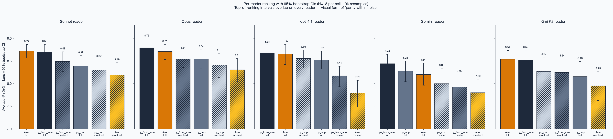

This repo tests a claim from the [Aver language](https://averlang.dev) project: that **structurally declared intent** (signatures, description markers, decision blocks, verify blocks) makes code legible for AI review without special training on the language.

**What we measure is *intent of the diff*, not *intent of the program*.** The reviewer sees a unified diff between a baseline and a refactored snapshot and has to reconstruct what the author was trying to *change*. This is a different question from "given the full codebase, what does this program do" — Aver may have stronger or weaker properties for whole-program comprehension than this benchmark can show. We deliberately stay in the PR-review frame: reviewer sees the diff, nothing more.

## How it works

Concrete example:

1. Take a program — say `workflow.av` (expense-report state machine in Aver).
2. Apply a change request (e.g. *"allow submitter to withdraw their submitted report"*) using a Claude Code agent. Result: `workflow.av` with new `withdraw_report` function and supporting types.
3. Compute the unified diff (before → after). Hand only that diff to a **reviewer LLM** with the question: *"what was the author trying to achieve?"*
4. Reviewer outputs a one-sentence guess (e.g. *"add withdrawal action with submitter-only permission and audit-trail preservation"*).
5. **Six judge models** (Claude Opus 4.7 + Sonnet 4.6 + Haiku 4.5 + OpenAI gpt-4o + gpt-4.1 + Moonshot Kimi K2, cross-vendor ensemble, median) score that guess on two axes (0–10 scale with descriptor anchors): did it match the original prompt? did it match what actually changed in the diff?

```
program + prompt → agent refactors → diff → reviewer LLM guesses → 6 judges score
```

Repeat for **18 prompts × 4 programs × 3 language variants × 6 non-thinking reader LLMs × 3 views ≈ 918 slices** (plus 126 for the thinking-tier probe), each scored by the 6-judge ensemble. Higher P+D = reviewer reconstructed intent more accurately.

**The three language variants** (same program, different surface):
- `aver` — the original.
- `pfa` (`python_from_aver`) — Aver translated to Python: same intent structure (frozen dataclasses, `?`-equivalent docstrings, module-level Design decisions), just Python syntax.
- `python_oop` — idiomatic OOP Python — what a Python dev would write naturally, with no Aver-style intent declarations.

**Two views per slice**: `full` (diff with all prose visible) and `masked` (prose stripped — for Aver: `intent`/`decision`/`?`/`verify`; for Python: docstrings + comments). Comparing the two tells us how much each language's prose layer actually carries.

The point: Aver's claim is that structurally declared intent (`intent`/`decision`/`?`/`verify`) makes code legible for AI review without special training. By comparing it to the *same intent structure carried in Python*, we can isolate "intent format wins" from "Python's training priors win."

Headline findings (replication-noise floor = 0.11 per `(reader, lang, view)` cell at N=18; differences below ~0.15 are statistically indistinguishable):

1. **Aver = Aver-in-Python on full diffs, parity within noise.** `python_from_aver` (shortened to `pfa` throughout) is a faithful transliteration of Aver — same intent structure, Python as carrier. On full diffs the gaps are: Sonnet +0.04 (aver 8.72, pfa 8.69), gpt-4.1 −0.03 (8.65 vs 8.68), Opus −0.08 (8.71 vs 8.79), Kimi K2 +0.02 (8.54 vs 8.52), Gemini −0.24 (8.20 vs 8.44), Gemma +0.12 (8.39 vs 8.27). **Four of six readers sit inside the 0.11 noise floor** → genuine parity. Gemini (the weakest cloud reader) pulls pfa clearly ahead; Gemma (local 4B open-source) is the only reader where aver leads outright. Aver's strong claim ("a never-seen language reads like Python") survives across Anthropic + OpenAI + Moonshot top-tier readers and a local open-source reader. Idiomatic `python_oop` sits 0.13–0.59 below on strong readers.

2. **On masked diffs (prose stripped), pfa wins by ~0.30–0.66 — narrative prose carries more signal in Aver.** Across all 6 readers, `aver/masked` is below `pfa/masked` by 0.24 / 0.23 / 0.40 / 0.03 / 0.24 / 0.66 (Sonnet / Opus / gpt-4.1 / Gemini / Kimi K2 / Gemma). Five of six are 2–6× the noise floor → real effect (only Gemini's 0.03 is inside noise). Stripping `intent` / `decision` / `?` from Aver removes more legibility than stripping docstrings + comments from a structurally-rich Python file. Interpretation: Python's named functions / classes / type hints carry residual intent when prose is gone; Aver's naming is intentionally tighter, so prose carries more of the burden.

3. **`verify` blocks are spec, not review-time doc.** Stripping narrative but keeping `verify` (`masked_spec`) shifts Aver by +0.05 / −0.04 / +0.17 / −0.17 / −0.10 / +0.15 across Sonnet / Opus / gpt-4.1 / Gemini / Kimi / Gemma — all inside or near the noise floor. Verify is executable spec; reviewers don't read it as legibility prose.

4. **On `payment_ops` (1300-line multi-module), pfa beats Aver on architectural refactors (+0.46) more than on additive (+0.16).** `python_oop` drops to 7.61 on those same architectural prompts (below Aver 8.19) — heavy docstrings, not Python itself, survive architectural diffs at scale. Gap held after v2 canonical rewrite AND post-fill 100% coverage validation (not a baseline artifact, not a judge-panel artifact). Pooled across 6 readers and 6 judges.

**v2 canonical rerun.** All Aver files pass `aver check`; all pfa files carry matching "Design decisions:" sections and complete docstrings. python_oop code was not touched, so only aver + pfa were rerun — python_oop rows are the v1 results carried over unchanged.

**What this benchmark measures.** How well an LLM reviewer reconstructs the intent of a change from a unified diff — nothing about whole-program comprehension, production readability, or human-in-the-loop review.

**What it doesn't measure** (where Aver's value sits separately): compile-time enforcement of intent/verify coverage (`aver check` makes prose mandatory; Python relies on convention which erodes over time), executable spec running (`aver verify` actually runs the examples), sum types + exhaustive `match` for correctness-by-construction, `decision`-block queryability (`aver why` traces rationale), `aver context` for whole-program projection, compilation to Rust/WASM. None of those would surface in a snapshot diff-review test. The benchmark gives Aver an empirical floor on one specific question (LLM diff review); broader claims about Aver's value need other evidence. Also: **scale here is small** (4 programs, 18 prompts, N=18 per cell) — this is a focused study, not a definitive comparison.

## What we measured

### Two scoring axes per slice

- **Prompt-axis (P)** — how well the reviewer's guess matches the original change request.
- **Diff-axis (D)** — how faithfully the reviewer's guess describes what actually changed in the code.

(A third axis, *change quality*, is also computed per `(prompt, lang)` but is not the primary signal; see `src/intent_trace/judges.py`.)

### Two views per slice

- **full** — the unified diff as a PR reviewer sees it (before/after, 3 lines of context around changes).
- **masked** — same diff, but with the **prose layer stripped**: in Aver that's `intent = …`, `decision …`, `? "…"` descriptions, and `verify …` blocks; in Python that's docstrings and `#` comments. Ablation tells us what each language's prose layer actually transmits.

  **Caveat on `verify` blocks.** Aver `verify` is an executable specification — closer to a Python `assert` than to a docstring. Stripping it therefore mixes "narrative prose" with "spec" in a way that is asymmetric across languages (Python `assert` statements are *not* stripped in the masked view). We ran a follow-up view `masked_spec` that preserves `verify` while still stripping `intent`/`decision`/`?` prose (for Python it's identical to `masked` since `assert` was never stripped — useful as a replication-noise control).
- **masked_spec** — narrative prose stripped, executable spec (`verify`/`assert`) preserved. The difference between `masked` and `masked_spec` isolates how much signal the spec layer carried.

### Three language variants

- **aver** — the original.
- **python_from_aver** — **Aver written in Python.** Same intent structure, same decision decomposition, same function boundaries — just Python syntax as carrier. Frozen dataclasses instead of `record`, pure functions, `replace()`-based updates, docstrings carrying what would be `?` descriptions in Aver, module-level "Design decisions:" sections mirroring Aver `decision` blocks, `assert` where Aver has `verify`. **Crucially: in Aver the prose layer is compiler-enforced (`aver check` fails if `verify` / `intent` coverage is incomplete); in `python_from_aver` the same structure is convention — a maintainer could let it drift and Python wouldn't complain.** The benchmark measures a snapshot where both variants carry matching prose; long-term maintenance under enforcement vs convention is a different question this benchmark doesn't test.
- **python_oop** — an OOP Python design of the same programs (classes with methods, mutation where natural, typed exception hierarchy). Intended as "the Python a Python dev would actually write."

### The three variants, side by side

Same `reserveStock` operation. Full files in `programs/inventory/`; here the minimum to show where they diverge:

**Aver** — `Result<T, E>`, explicit `match`, `? "..."` + `verify` per function. Every design choice is in prose that `aver check` enforces:

```aver
module Inventory
    intent = "Multi-warehouse inventory. Separates available from reserved so pending orders do not over-commit."

decision SeparateAvailableAndReserved
    reason = "Collapsing reserved into available would allow a second reservation to over-commit the same units."
    chosen = "SplitAvailableReserved"
    rejected = ["SingleAvailableCounter"]

fn reserveStock(inv: Inventory, warehouseId: String, skuId: String, qty: Int) -> Result<Inventory, String>
    ? "Reserves qty for an order. Fails if qty would exceed (onHand - reserved)."
    match qty <= 0
        true -> Result.Err("Reserve qty must be positive")
        false -> reserveStockChecked(inv, warehouseId, skuId, qty)

verify reserveStock
    reserveStock(sampleInventory(), "W1", "S1", 0) => Result.Err("Reserve qty must be positive")
    reserveStock(sampleInventory(), "W1", "S1", 3) => Result.Ok(applyReserve(sampleInventory(), "W1", "S1", 3))
```

**Aver-in-Python** — same intent as module docstring + Design decisions section, same function-level prose as docstring, free functions over frozen dataclasses. Current baseline uses `raise` instead of a Result dataclass (loose transliteration). Prose here is convention, not enforced:

```python
"""Multi-warehouse inventory... Design decisions: separate available/reserved
(collapsing would let a second reservation over-commit); errors raised (loose
form — strict Aver-in-Python would return a Result sum type)."""

def reserve_stock(inv, warehouse_id, sku_id, qty) -> Inventory:
    """Reserve qty for an order. Raises if qty would exceed available."""
    if qty <= 0: raise ValueError("Reserve qty must be positive")
    if not known_warehouse(inv, warehouse_id): raise ValueError(f"Unknown warehouse: {warehouse_id}")
    # ... known_sku guard, available guard, return replace(...)
```

**Idiomatic Python** — class with mutation, typed exception hierarchy, private `_require_*` helpers. **Design rationale not stated anywhere** — a reviewer infers from class shape, attribute names, and exception class names:

```python
class Inventory:
    def reserve(self, warehouse_id, sku_id, qty) -> None:
        if qty <= 0: raise NonPositiveQtyError("Reserve")
        self._require_warehouse(warehouse_id)
        self._require_sku(sku_id)
        lvl = self._mutable_level(warehouse_id, sku_id)
        if qty > lvl.available: raise InsufficientStockError(qty, lvl.available)
        lvl.reserved += qty
```

Same guard sequence and state change. Where they diverge is the **intent surface area** that reaches an LLM reviewer from a diff: Aver states every choice in prose (enforced), pfa states the same as docstrings (convention), python_oop states nothing — the reader reconstructs it from shape.

Both Python variants cover the same domains as Aver and their smoke tests pass independently. v1 baselines had inconsistent prose density across programs — v2 canonical rerun addresses this (Aver passes `aver check` with full verify; pfa has matching Design decisions + complete docstrings; python_oop unchanged as control).

## Programs

| program | description | size |
|---|---|---|
| `inventory` | warehouse + SKU + reservations + reorder | ~250 lines Aver, 5 prompts |
| `workflow` | expense-report approval state machine | ~200 lines Aver, 5 prompts |
| `taskmanager` | multi-module (models / validation / projects / tasks / main) | ~400 lines Aver, 4 prompts |
| `payment_ops` | real multi-module domain: webhook normalize, cases, ledger, reconcile, views | ~1300 lines Aver, 4 prompts |

Prompts range from specific refactors ("reject negative prices") to vague directives ("make it harder to lose stock"), including one large architectural change per program.

## Methodology note: model choices

The **main ensemble** is 6 **non-thinking** readers + 6 non-thinking judges (single forward pass per call, not reasoning / chain-of-thought modes). Mixing thinking and non-thinking in the same ensemble would confound "model ability" with "compute budget per call." Concretely:

- **Sonnet 4.6, Opus 4.7, gpt-4.1, Gemini 2.5 Flash**: non-thinking default, no extended-thinking flag set.
- **Kimi K2 reader + judge**: deliberately `kimi-k2-0905-preview` (non-thinking K2 snapshot, 262k context) rather than `kimi-k2.5` or `kimi-k2-thinking`. K2.5 defaults to thinking mode with `reasoning_content` consumed internally — that's a different tier than other non-thinking readers.
- **Gemma 4 e4b (local 4B, Ollama)**: non-thinking open-source reader run fully locally on frozen weights — no cloud, no chance of training-corpus contamination mid-run.
- **Claude Opus / Sonnet / Haiku judges**: non-thinking (no extended thinking flag).

### Clean thinking-flag isolation via K2 snapshot

Most thinking-vs-non-thinking comparisons in the wild confound two axes:
(a) the thinking flag itself (extended chain-of-thought before final answer), and
(b) generation / capability tier of the model (K2 → K2.5 is a newer model, Gemini Flash → Pro is a different tier entirely, e4b → 26b is 6.5× more parameters).

Moonshot publishes **`kimi-k2-0905-preview`** (non-thinking) and **`kimi-k2-thinking`** as two serving modes of the same underlying snapshot — a rare opportunity to test the thinking flag with generation held constant. We use this pair as a **pure thinking-flag control**, and separately compare K2-0905 against K2.5 (newer generation + thinking, confounded) to quantify how much of the headline "thinking improvement" in the field is actually generational lift. See Finding #7 for the result.

This methodology transfers: for any benchmark claiming "X improves with thinking," look for a same-snapshot same-weights thinking-flag-flipped pair. If the vendor doesn't publish one, the claim mixes thinking with generation — which the K2.5 and Gemini Pro-vs-Flash comparisons in this repo both do.

**Separately**, we ran a **thinking-tier probe** with Kimi K2.5 as reader (thinking on; judges still non-thinking). See "Thinking-tier probe" section in Results — additional thinking probes (Kimi K2-thinking, Gemini 2.5 Pro, Gemma 4 26b) run in parallel; main ensemble and headline findings stay non-thinking.

Real-world PR review bots, IDE assistants (Cursor, Claude Code, Copilot), CI checks — all use non-thinking models for latency (sub-second response). Benchmark matches that tier. A full "reasoning-tier benchmark" (all readers in thinking mode) is a separate open direction and estimated at ~$1,500+ in API costs.

## Results

**All numbers below use the 6-judge cross-vendor ensemble (Claude Opus 4.7 + Sonnet 4.6 + Haiku 4.5 + OpenAI gpt-4o + gpt-4.1 + Moonshot Kimi K2-0905, median), applied to every slice of every reader. v2 canonical baselines (all Aver passes `aver check`; all `python_from_aver` has matching Design decisions docstrings). 918 measured slices total across 6 non-thinking readers (sonnet/opus/gpt-4.1/gemini/kimi/gemma); a separate 126-slice thinking-tier probe (kimi-k2.5) is reported in its own section. N=18 per `(lang, view)` cell on every reader, except pfa/oop masked which has effective N=36 on pre-skip-fix readers — see noise floor methodology note below.**

**Replication-noise floor: 0.11.** During the build we discovered that `mask_for_view` applies an *identical* mask to `masked` and `masked_spec` for `python_from_aver` and `python_oop` (verify ablation only carries semantic meaning for Aver, where `verify` is a syntactic block). Rather than discard those duplicate runs, we treat them as **two independent samples of the same input** — a free measurement of replication noise. Per-row noise across 4 readers × 72 paired runs: mean |Δ| = 0.39, median 0.30, P90 0.90 (max 1.75); per-reader-cell-mean noise (N=18): 0.04–0.18, average 0.11. **Differences below ~0.15 are inside this floor.** For pfa/oop masked, both samples are pooled → effective N=36, dropping the cell noise to ~0.08.

### Per-reader ranking (full view, avg = (P+D)/2, v2 canonical, N=18)

```
Claude Sonnet 4.6 (reader):
  1. aver              full    8.72   ← +0.04 vs pfa (inside noise floor)
  2. python_from_aver  full    8.69
  3. python_oop        full    8.39

Claude Opus 4.7 (reader):
  1. python_from_aver  full    8.79   ← +0.08 vs aver (inside noise floor)
  2. aver              full    8.71
  3. python_oop        full    8.54

OpenAI gpt-4.1 (reader):
  1. python_from_aver  full    8.68   ← +0.03 vs aver (inside noise floor)
  2. aver              full    8.65
  3. python_oop        full    8.52

Moonshot Kimi K2-0905 (reader):
  1. aver              full    8.54   ← +0.02 vs pfa (inside noise floor)
  2. python_from_aver  full    8.52
  3. python_oop        full    8.16

Google Gemini 2.5 Flash (reader):
  1. python_from_aver  full    8.44   ← +0.24 vs aver (above noise floor — pfa leads)
  2. python_oop        full    8.28
  3. aver              full    8.20

Google-OSS Gemma 4 e4b (local non-thinking 4B reader):
  1. aver              full    8.39   ← +0.12 vs pfa (marginally above noise floor — aver leads)
  2. python_from_aver  full    8.27
  3. python_oop        full    7.80
```

**On the four strong cloud readers (Sonnet / Opus / gpt-4.1 / Kimi K2), aver and pfa are inside the 0.11 noise floor — genuine parity across Anthropic / OpenAI / Moonshot vendors.** On the weakest cloud reader (Gemini Flash), pfa leads by 0.24 (above noise). **Gemma 4 e4b** — a small (4B) open-source model running fully local on consumer hardware with frozen weights (no chance of cloud-side Aver exposure in training data) — is the **only reader where Aver wins outright on full diffs** (+0.12 vs pfa, marginally above noise). This is the strongest possible "zero training exposure" data point. Idiomatic `python_oop` sits 0.13–0.59 below pfa on all readers.

**Opus saturation observation**: Opus aver/full = 8.71 ≈ Sonnet aver/full = 8.72 (within 0.01). Aver "saturates" at Sonnet capability — adding top-tier reasoning doesn't extract more legibility from Aver. pfa and oop continue to rise with capability (Opus pfa 8.79, Opus oop 8.54), so the edge Pythons pull at the top is from training-prior exploitation on Python-specific patterns, not from reading more of the diff.

### Ranking with 95% bootstrap CIs

Plot at the top of this README. Error bars are 95% bootstrap confidence intervals over the N=18 per-cell slices (10k resamples). Top-of-ranking intervals overlap on every reader — visual form of "parity within noise." (Sonnet-only version: `results/plots/ranking.png`.)

### Full cross-reader comparison

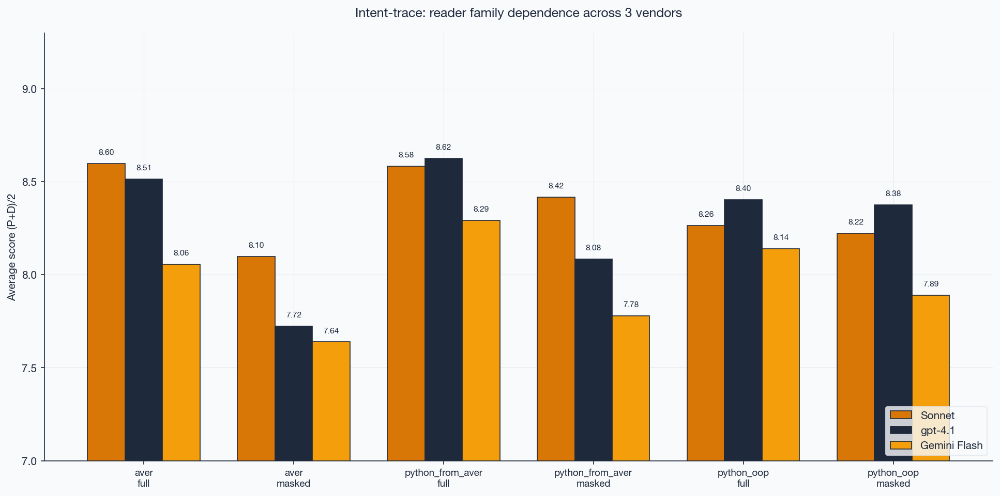

```
lang/view                  Sonnet  Opus    gpt-4.1  Gemini  Kimi K2  Gemma
aver/full                  8.72    8.71    8.65     8.20    8.54     8.39
aver/masked                8.19    8.31    7.79     7.80    7.95     7.24
aver/masked_spec           8.24    8.27    7.96     7.63    7.85     7.39
python_from_aver/full      8.69    8.79    8.68     8.44    8.52     8.27
python_from_aver/masked    8.43    8.54*   8.19     7.83    8.19     7.90
python_oop/full            8.39    8.54    8.52     8.28    8.16     7.80
python_oop/masked          8.29    8.41    8.40     8.05    8.23     7.25
```

N=18 per cell across all 6 readers (except Opus pfa/masked N=18 vs others N=36 — readers run after the skip-fix don't have duplicate masked runs to pool). `pfa/masked` and `oop/masked` show effective N=36 where we pooled duplicate runs (`masked` and `masked_spec` use identical input for non-Aver languages; see "Replication-noise floor" methodology note). `aver/masked_spec` is shown separately because for Aver it's a real ablation (preserves `verify` blocks). **Gemma caveat**: 4 of 122 original slices failed JSON parsing at `max_tokens=512` and were retried at `max_tokens=2048` — minor (1-slice-level) score inflation possible on one retried cell; doesn't shift any mean outside noise.

\* Opus pfa/masked is N=18 only — the skip-fix (which avoids running masked_spec for non-Aver languages since it duplicates masked) was active when Opus was run, so we have one LLM-B call for pfa/masked rather than the pooled two. Noise floor for this cell is ~0.11 (not 0.08). Earlier readers were run before the skip-fix so have both runs pooled.

### Judge × reader grid (who is kind to whom)

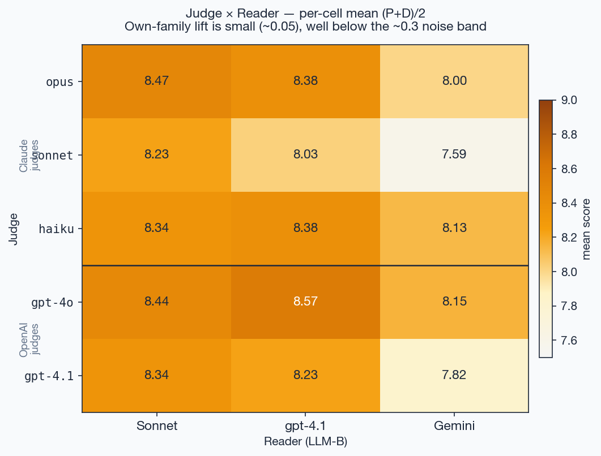

### Judge family × language (GPT is kinder to Aver)

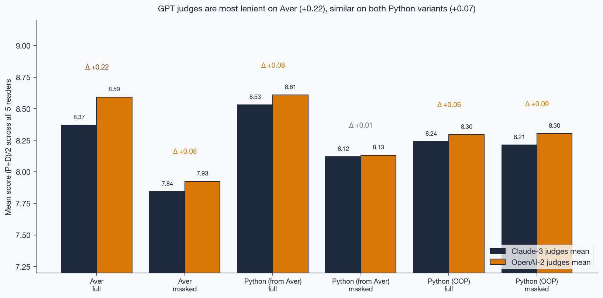

### Ablation across all readers

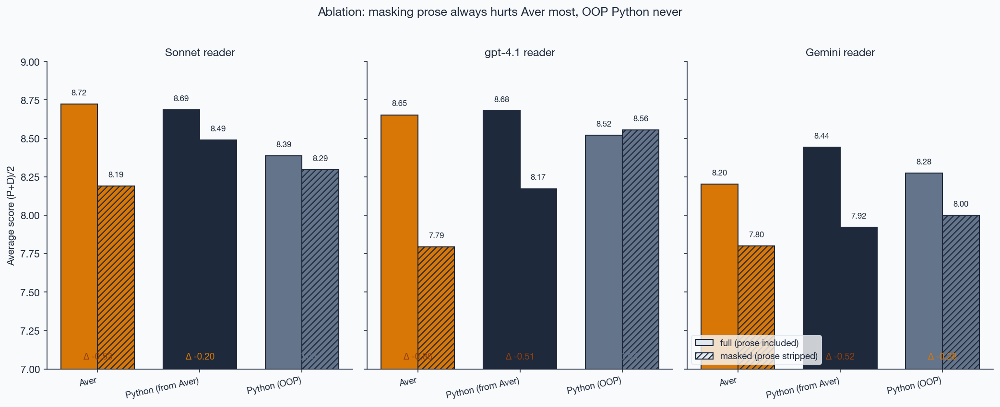

### Judge-family bias

Each judge family scores its own-vendor reader slightly higher, but only by ~0.05 — small vs the ~0.3 noise band. GPT judges are uniformly ~0.1 more lenient than Claude. The bigger effect is **by language**: GPT judges score Aver guesses +0.22 higher than Claude do (vs +0.07 on Python variants) — so adding GPT judges to a Claude-only panel lifted Aver's relative position most.

### Per-program breakdown

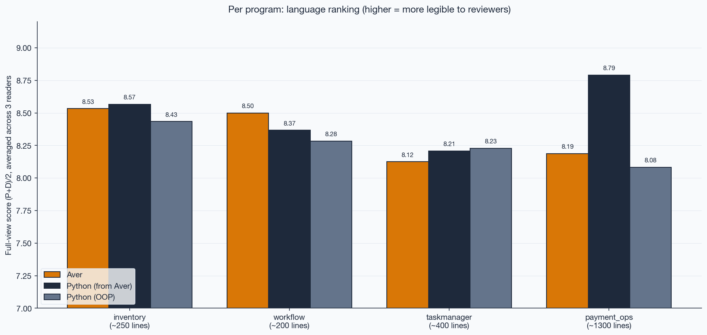
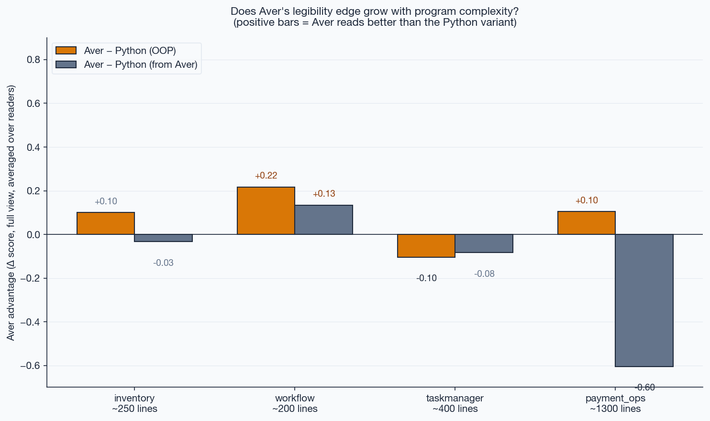

Aver's relative position varies with program size: near-parity or small edge on `inventory`/`workflow`/`taskmanager`, clear loss on `payment_ops` (1300 lines). Stratified by diff-type below — the `payment_ops` loss concentrates on architectural refactors, not additive changes.

### Inter-judge agreement (Krippendorff's α)

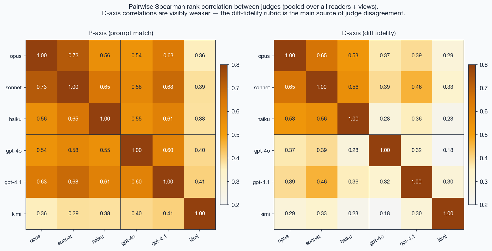

Pooled α_ordinal: **P-axis 0.54, D-axis 0.28** — both below the 0.67 "tentative" threshold. Judges agree on ranking (pairwise Spearman ρ̄ ≈ 0.60 on P) but not on absolute per-item scores. Aggregate cell means (N=18 × 5 judges = 90 scores per cell) average most of that out — directional comparisons are informative, per-slice claims aren't. D-axis disagreement is the strongest argument for a future human-rater sanity pass.

Per-judge means on Sonnet reader: Opus P=8.33 D=8.61, Sonnet P=7.76 D=8.69, Haiku P=7.86 D=8.81, gpt-4o P=7.53 D=9.36, gpt-4.1 P=7.66 D=9.02. OpenAI judges are stricter on P (−0.3 to −0.4) and more lenient on D (+0.3 to +0.6); biases partly cancel in (P+D)/2.

### Per-axis breakdown

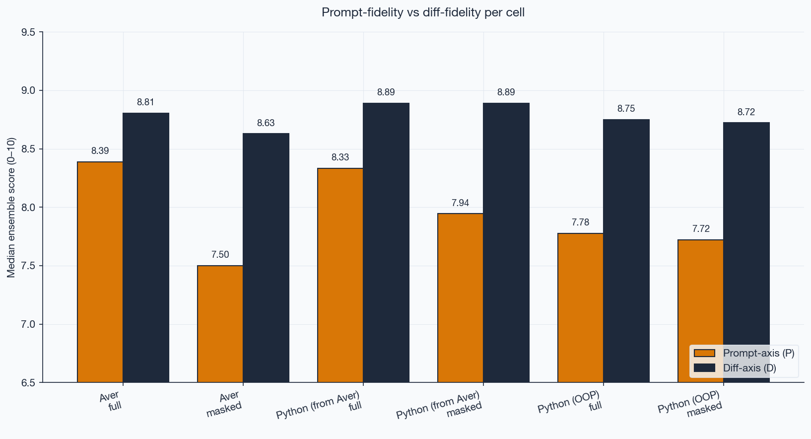

### Ablation — what strip of prose reveals (Sonnet reader, 6-judge)

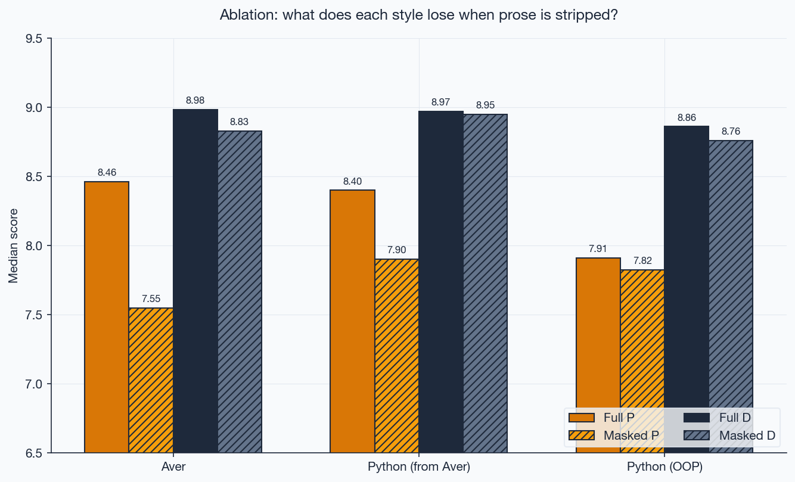

```
Aver              full → masked   ΔP = -0.91   ΔD = -0.16
Python (from Aver) full → masked   ΔP = -0.50   ΔD = -0.02
Python (OOP)      full → masked   ΔP = -0.09   ΔD = -0.10
```

The pattern replicates across every reader: `aver/masked` is the lowest-scoring cell of all six under Sonnet (8.19), gpt-4.1 (7.79), Gemini (7.80), and Kimi (7.95). Aver concentrates intent in prose that a reviewer cannot reconstruct from the code alone. Idiomatic OOP Python has very little to lose.

### Per diff-type — where Aver's payment_ops loss actually lives

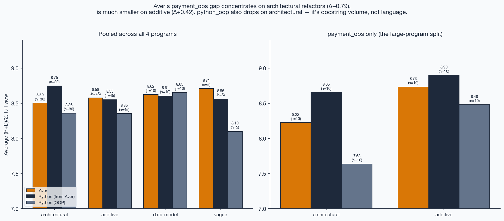

18 prompts hand-classified: architectural (6), additive (9), data-model (2), vague (1). On payment_ops split:

| category | aver | pfa | python_oop | Δ pfa−aver |
|---|---:|---:|---:|---:|
| architectural | 8.19 | 8.65 | 7.61 | **+0.46** |
| additive | 8.71 | 8.86 | 8.47 | +0.16 |

Aver's payment_ops loss concentrates on architectural refactors — where both Aver and idiomatic OOP Python struggle (8.19 and 7.61), and only heavy-doc `python_from_aver` survives (8.65). On additive prompts the gap shrinks from 4× noise to inside-noise.

### Thinking-tier probe — Kimi K2 vs K2.5 (and more)

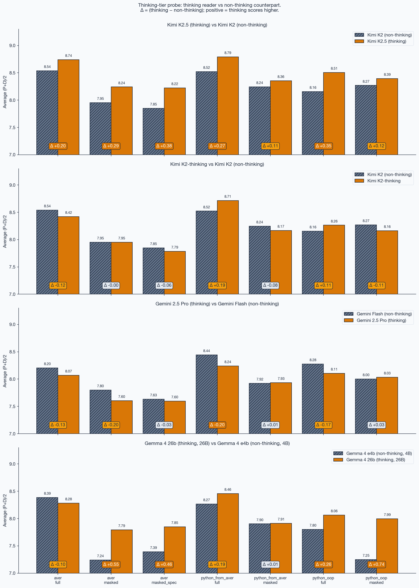

We ran additional thinking readers outside the main non-thinking ensemble to probe whether scaling to an all-thinking benchmark would be worth the ~10× cost. Each thinking reader is paired with its closest non-thinking counterpart (same vendor where possible). Judges stay non-thinking (same 6-judge ensemble as main). This is a *probe*, not a full thinking-tier study.

**Primary pair: Kimi K2 (non-thinking) vs K2.5 (thinking)**

| view | K2 (non-thinking) | K2.5 (thinking) | Δ |
|---|---:|---:|---:|
| aver / full | 8.54 | **8.74** | +0.20 |
| aver / masked | 7.95 | **8.23** | +0.28 |
| aver / masked_spec | 7.85 | 8.21 | +0.36 |
| pfa / full | 8.52 | **8.79** | +0.27 |
| pfa / masked | 8.24 | 8.37 | +0.13 |
| oop / full | 8.16 | **8.51** | +0.35 |
| oop / masked | 8.23 | 8.41 | +0.18 |

**Aver/masked gap shrinks from −0.29 to −0.14** (comparing aver vs pfa within K2.5) — when the reader thinks, stripping prose hurts Aver less. One interpretation: Aver's intent is structurally present (in `?`, `match` exhaustiveness, function signatures, module layout), and a thinking reader can reconstruct it even without the narrative prose. A non-thinking reader does not have the budget to do that reconstruction in-line, so the prose carries more of the load.

Limits of this probe:
- **N=1** within the thinking tier — one model, one vendor. Anthropic Opus extended-thinking, Gemini 2.5 Pro, or OpenAI o-series could move differently.
- **Thinking judges would be a separate experiment.** Here the judges stay non-thinking (same 6-judge ensemble as main) — what we measure is *reader-side thinking*, with judges held constant. A full all-thinking ensemble (thinking readers + thinking judges) is estimated at ~$1,500+ and left as future work.
- **Kimi K2.5 is a newer model generation** than K2-0905, not *only* thinking flipped. Some of the +0.20 to +0.35 gain may be generational, not thinking. A cleaner ablation would use `kimi-k2-thinking` (K2 snapshot with thinking only) vs K2-0905 — same generation, only thinking flipped. Left as follow-up.

Thinking reader data: `results/merged/kimi2.5.jsonl` (126 slices, 100% coverage under 6-judge ensemble).

### Verify-preserving ablation (`masked_spec` vs `masked`)

Addresses an asymmetry concern: `masked` strips Aver's `verify` blocks even though they're executable spec (like Python `assert`, which isn't stripped). `masked_spec` keeps `verify`, strips narrative only. Aver `masked → masked_spec` deltas: +0.06 / +0.17 / −0.17 / −0.10 across Sonnet / gpt-4.1 / Gemini / Kimi — all four inside the 0.11 replication-noise floor (or close to 2× of it). **Verify is spec, not review-time doc** — the legibility drop comes from narrative prose (`intent`/`decision`/`?`), not from `verify`. (For pfa/oop the same view is identical input to `masked` since `assert` isn't stripped, which is what gave us the noise floor measurement.) Numbers per reader visible in the "Full cross-reader comparison" table above (compare the `aver/masked` vs `aver/masked_spec` rows).

## Findings

Read these as statements about the specific setup described above — 6 reader families across 5 model sources (Anthropic / OpenAI / Google cloud / Google-OSS / Moonshot), 6 judge models spanning 3 vendors (Anthropic / OpenAI / Moonshot), 3 agent-generated baselines, 18 prompts across 4 programs — not as universal claims.

1. **Aver ≈ Aver-in-Python on strong readers, parity within the 0.11 noise floor.** Four of six readers sit inside the floor on full diffs: Sonnet +0.04 (8.72 vs 8.69), Opus −0.08 (8.71 vs 8.79), gpt-4.1 −0.03 (8.65 vs 8.68), Kimi K2 +0.02 (8.54 vs 8.52). Gemini (the weakest cloud reader) shows pfa leading clearly: −0.24 (8.20 vs 8.44). Gemma (local 4B open-source) is the only reader where aver leads outright: +0.12 (8.39 vs 8.27). Aver sits 0.13–0.59 above idiomatic `python_oop` across all six readers. Genuine parity for a language with zero training exposure.

2. **"Home-field advantage" is small after expansion.** Adding Moonshot Kimi as a 6th judge (now 4 vendors: Anthropic / OpenAI / Google / Moonshot) didn't reshuffle the top. Judge-family preference for own-vendor reader stays ~0.05–0.10 — small vs the 0.11 noise floor. GPT judges score Aver guesses higher than Claude do (carrier-vendor effect), Kimi judges sit between Claude and GPT on Aver-friendliness. No single vendor's panel determines the ranking.

3. **Aver's signal lives in the narrative prose, not in `verify`.** Strip `intent` / `decision` / `?` / `verify` and Aver drops the most of any variant — `aver/masked` is the lowest-scoring cell on every reader (Sonnet 8.19, Opus 8.31, gpt-4.1 7.79, Gemini 7.80, Kimi 7.95, Gemma 7.24 — Gemma's absolute floor). A follow-up `masked_spec` ablation (preserving `verify`, stripping only narrative) shifts Aver by +0.05 / −0.04 / +0.17 / −0.17 / −0.10 / +0.15 across Sonnet / Opus / gpt-4.1 / Gemini / Kimi / Gemma — all six inside or near the noise floor. **Verify blocks are executable spec, not review-time doc.** The narrative prose (`intent` / `decision` / `?`) is the whole legibility story for diff review.

4. **On masked diffs, pfa beats Aver by 0.24–0.66 across cloud readers — Python's named structure carries residual intent.** When prose is stripped, pfa stays 0.24 / 0.23 / 0.40 / 0.03 / 0.24 / 0.66 above Aver (Sonnet / Opus / gpt-4.1 / Gemini / Kimi / Gemma). Five of six are 2–6× the noise floor — real effect (only Gemini at 0.03 is inside noise). Python's named functions, classes, and type hints survive prose stripping; Aver's tighter naming surfaces less when prose is gone.

5. **Aver's large-program loss concentrates on architectural refactors, survives canonical rerun.** On `payment_ops`, Aver's gap vs pfa is +0.46 on architectural prompts (4× noise floor — real) but only +0.16 on additive (inside noise). `python_oop` drops to 7.61 on those same architectural prompts, below Aver's 8.19 — so "heavy-doc Python beats Aver at scale" is really "heavy docstrings survive architectural refactors at scale; Aver and idiomatic OOP Python both struggle there, together." Not a baseline artifact: the gap held after v2 canonical rewrite.

6. **Per-item inter-judge agreement is low and got lower with the 6th judge** (α_ord pooled across 6 readers × 918 items: **P-axis 0.42, D-axis 0.15** with Kimi added; previously 0.54 / 0.28 on the 5-judge panel). Both well below the 0.67 "tentative" threshold. Pairwise Spearman ρ̄ ≈ 0.52 on P. Kimi judge correlates ~0.38–0.41 with the others on P-axis (vs 0.65–0.73 within the Claude family), so adding it diluted the ensemble's internal consistency — in exchange for true cross-vendor diversity (panel now spans Anthropic / OpenAI / Moonshot rather than 3 Anthropic + 2 OpenAI). **Interval α is higher and rises to 0.53 on P-axis / 0.37 on D-axis** — judges rank items consistently even when absolute scores drift. Judges still agree on *ranking* (Spearman stays positive, cell means stable within noise floor), but fine-grained per-slice claims aren't trustworthy. Noteworthy: Gemma reader produces the highest per-reader α_int (P=0.67, D=0.56) — its terser, more declarative guesses are easier for judges to score consistently. Human raters on a stratified subsample remain the single cleanest remaining improvement.

7. **Capability tier closes the Aver/masked gap; pure thinking flag alone does not.** Three thinking-tier probes, only one of which cleanly isolates the thinking flag from generation/size:

   - **K2-0905 (non-thinking) → K2-thinking (same snapshot, thinking flag flipped only)** — Moonshot publishes both as serving modes of the same underlying model, a rare opportunity for a pure thinking-flag control. Deltas on all 7 (lang, view) cells, N=18 matched prompts: aver/full **−0.12**, aver/masked **0.00** (exactly), aver/masked_spec **−0.06**, pfa/full **+0.19**, pfa/masked **−0.08**, oop/full **+0.11**, oop/masked **−0.11**. **All inside the 0.11 noise floor. Pure thinking flip ≈ zero on every metric.**
   - **K2-0905 → K2.5 (newer generation, also thinking)** — same matched-prompt comparison: +0.20, +0.29, +0.38, +0.27, +0.11, +0.35, +0.12. **Consistent +0.11–0.38 lift across every cell** — but generation and thinking are confounded.
   - **Gemma 4 e4b (4B non-thinking) → Gemma 26b (6.5× larger + thinking)**, N=16/18 prompts currently: aver/full −0.14, aver/masked +0.52, pfa/full +0.20, oop/masked +0.82. Similar pattern — significant lift on most cells, size/thinking confounded.

   **The clean test kills the "thinking closes the gap" hypothesis.** Comparing K2.5 to K2-thinking on the same 18 prompts: K2.5 gains +0.29 on aver/masked, K2-thinking gains 0.00 — so the ~+0.30 gap-closing visible in K2.5 is entirely generational, not the thinking flag.

   **Implication for the Aver thesis.** Aver's prose layer is most load-bearing for **quick-pass readers** — PR review bots, IDE assistants (Cursor, Claude Code, Copilot), CI hooks — all running non-thinking cloud tiers for latency. Deep-analyst tier (thinking + top capability) recovers structural intent even when prose is stripped. Aver's `aver check` enforcement of prose coverage directly protects the quick-pass tier that industrial code review actually uses; Python leaves the same structure to convention, which drifts.

   **Anomaly worth naming.** Aver/full appears to saturate at small non-thinking capability: Gemma e4b full=8.40 ≈ Gemma 26b full=8.27 (on 16 prompts, within noise); Opus full=8.71 ≈ Sonnet full=8.72 (within 0.01). Adding capability lifts pfa and oop on full diffs, and lifts every variant on masked, but extracts nothing more from Aver's full-diff form. Aver's declarative signature + prose on full diffs appears to be low-cognitive-load-to-reconstruct; the headroom lives in masked cells.

## Why this experiment even exists

[Aver's thesis](https://averlang.dev) is that code must be **legible to an AI reviewer** — that the artifact carries intent so a reviewer (human or AI) can reconstruct it without prior familiarity. This benchmark operationalizes that claim: we treat an LLM as the reviewer, measure how much intent it can reconstruct from each artifact style, and compare across training-exposure asymmetries.

The headline, stated cautiously: **Aver's structural intent declarations (`intent`, `decision`, `?`, `verify`) reach parity with a faithful Python transliteration on full diffs**, within the directly-measured 0.11 noise floor — on four of six non-thinking readers (Sonnet, Opus, gpt-4.1, Kimi K2). Gemini 2.5 Flash (weakest cloud reader) shows pfa ahead by 0.24; Gemma 4 e4b (local 4B open-source) is the one reader where aver leads outright (+0.12), the strongest possible "zero training exposure" data point. Aver's parity is notable: with essentially no training exposure, the language reads as legibly as Python does to top-tier readers across Anthropic / OpenAI / Moonshot, and to a local frozen-weights open-source reader. Opus (strongest cloud) saturates at Sonnet level on Aver (8.71 ≈ 8.72) while pulling pfa/oop further up — so the top-tier edge Python enjoys is from training-prior exploitation, not from extracting more intent. On masked diffs (prose stripped), pfa pulls ahead by 0.03–0.66 across all six readers — Python's named structure carries residual intent when prose is gone, Aver's tighter naming surfaces less. A thinking-tier probe (Kimi K2.5) shrinks that masked gap from −0.29 to −0.14, suggesting thinking readers can reconstruct Aver's structural intent even when prose is stripped. At 1300 lines of multi-module domain code, paragraph-scale Python docstrings pull ahead clearly on architectural refactors. The prose layer is load-bearing across the board — `aver/masked` is the weakest cell on every non-thinking reader — so the open question is whether richer module-level `intent` declarations can close the large-program architectural gap, or whether thinking-tier readers already close it.

## Scope and threats to validity

These are split into **scope** (what this benchmark does and doesn't measure — not validity issues, just boundaries) and **validity threats** (reasons the numbers inside the measured scope may still be wrong).

### Scope — what we are and aren't measuring

- **Diff review, not program comprehension.** We measure how well a reviewer reconstructs the *intent of a change* from a unified diff. We do not measure how well a reviewer understands the *intent of a whole program* given its full source. Aver has affordances for whole-program understanding (module `intent`, `decision` blocks, `aver context` tool) that this benchmark simply does not exercise. A Python-OOP program with a terse diff may still be harder to understand at the program level than an Aver program — that's a different, un-tested question.
- **Small domain coverage.** Four programs, 18 prompts total. Three are small/medium invented domains (inventory, workflow, taskmanager); one is a real-world multi-module domain (payment_ops, ~1300 lines). Typical enterprise codebases are 10k+ lines across dozens of modules; behavior at that scale is not tested.
- **Agent-produced refactors, not human commits.** Both the baselines and the refactors were generated by sub-agents (Claude Code) applying the change requests. Real open-source commits from human developers would reduce construct bias, but require domain-matched Aver corpora that don't yet exist.
- **`aver context` not exercised.** We initially ran an `aver_context` view (diffing compressed intent summaries) but concluded the setup was synthetic — `aver context` is a state-projection tool, not a change-representation tool, and diffing two projections doesn't match how reviewers actually use the tool. Scores collapsed in complex multi-module code for structural (not legibility) reasons. Code path dropped.

### Validity threats — reasons the measured numbers may be wrong

1. **Baseline inconsistency across programs — addressed in v2 canonical rerun.** pfa originally drifted (snake_case / camelCase mixed, docstring density 50–93%) and Aver before-files were missing `verify` coverage. v2 rewrote everything to canonical (Aver passes `aver check`, pfa has matching Design decisions + complete docstrings) and rerun only aver + pfa (python_oop code unchanged, so its v1 rows were carried over — no rerun). Headline #2 survived. Residual confound: docstring volume vs format (open follow-up: pfa trimmed to Aver-prose-volume).

2. **N=18 per cell is small; replication-noise floor 0.11.** Per-cell gaps below ~0.15 are inside the directly-measured noise floor (see Methodology note). For pfa/oop masked the noise is √2 lower because we pool the duplicated mask runs (effective N=36 on pre-skip-fix readers). Statistically strong differences: the 0.24–0.66 aver/pfa masked gap (5 of 6 readers), the 0.46 payment_ops architectural gap (4× noise). Bootstrap CIs on the ranking chart make this visible.

3. **Inter-judge agreement is low** (α ≈ 0.54 P-axis, 0.28 D-axis). See Finding #5. Human raters on a stratified subsample would be the strongest remaining improvement.

4. **Gemini 2.5 Flash is the weakest reader** (~0.3–0.7 below Sonnet and gpt-4.1). Looks like capability ceiling, not language bias — a Gemini-Pro rerun would clarify.

## Reproduce

```bash
# Install + API keys
uv sync
# .env needs: ANTHROPIC_API_KEY, OPENAI_API_KEY, GOOGLE_API_KEY, MOONSHOT_API_KEY

# Full pipeline for one reader (canonical: aver + pfa, all 3 views; pfa-masked_spec auto-skipped)
uv run --env-file .env python scripts/rerun_all.py sonnet
# (swap for gpt4.1 / gemini / kimi / opus to produce the other reader datasets)

# Cross-vendor judges on an existing run (reuse diffs+guesses)
INTENT_TRACE_JUDGE_GPT=gpt-4o uv run --env-file .env \
  scripts/add_gpt_judge.py results/ensemble_YYYYMMDD_HHMMSS/slices.jsonl
INTENT_TRACE_JUDGE_GPT=gpt-4.1 uv run --env-file .env \
  scripts/add_gpt_judge.py <above output>/slices.jsonl

# Merge resume runs into canonical per-reader JSONL
uv run python scripts/merge_judge_runs.py            # → results/merged/{sonnet,gpt4.1,gemini,kimi}.jsonl
# Fill judges that a prior run missed (e.g. 503s, credit fails)
uv run --env-file .env python scripts/fill_missing_judges.py all
# Re-run LLM-B + 6 judges on slices a reader skipped
uv run --env-file .env python scripts/fill_missing_slices.py gemini

# MANDATORY: verify 100% judge coverage before publishing any result
uv run python scripts/coverage_check.py   # fails loud if any row has <6 judges

# Plots
uv run python scripts/plot_results.py     # ranking, axes, ablation, 3-way reader
uv run python scripts/plot_heatmaps.py    # reader × program × lang × view heatmaps
```

## Layout

```
programs/<program>/
  aver/before/*.av                           # original Aver baseline
  aver/after/<prompt>/*.av                   # refactor applied by agent
  python_from_aver/before/*.py               # Aver-translated-style Python baseline
  python_from_aver/after/<prompt>/*.py
  python_oop/before/*.py                     # independent OOP Python baseline
  python_oop/after/<prompt>/*.py
prompts/<program>/*.md                       # change request per prompt

src/intent_trace/
  judges.py                                  # 3 rubrics + ensemble median
  mask.py                                    # prose-stripping for ablation

scripts/
  run_all.py                                 # pipeline entrypoint (LLM-B + judges)
  add_gpt_judge.py                           # append a cross-vendor judge to a finished run
  fill_missing_judges.py                     # patch missing GPT judges on merged datasets
  fill_missing_slices.py                     # re-run LLM-B + 6 judges for slices a reader dropped
  merge_judge_runs.py                        # collapse resume runs into one canonical JSONL per reader
  plot_results.py                            # ranking / axes / ablation / 3-way reader charts
  plot_heatmaps.py                           # reader × program × lang × view heatmaps

results/ensemble_<timestamp>/                # raw pipeline outputs (one per reader × model-B run)
  meta.json                                  # plan + model IDs
  slices.jsonl                               # one slice per line (append-only, crash-safe)
  SUCCESS                                    # marker after clean finish
results/gpt_added_<timestamp>/               # add_gpt_judge.py outputs
results/merged/<reader>.jsonl                # canonical per-reader dataset (deduped, 6-judge)
```

## Status

Dataset is complete for 6 non-thinking readers + 1 thinking-tier probe (v2 canonical rerun with post-fill validation): 918 main + 126 probe = 1,044 slices × 6 judges × 2 axes = 12,528 judgments, **100% judge coverage verified** via `scripts/coverage_check.py`. N=18 per `(lang, view)` cell on every reader; effective N=36 for pfa/oop masked on readers run before the skip-fix (sonnet/gpt4.1/gemini/kimi), N=18 for Opus, Gemma, and Kimi K2.5 (skip-fix active). python_oop rows for the original 3 readers are v1 carried over (code was not touched by canonical rewrite — only aver + pfa were rerun); Kimi K2, Opus, Gemma, and K2.5 were rerun for all three languages. Findings above are stable under the directly-measured 0.11 noise floor. PRs welcome to add languages, models, or programs.

## Citation

If you use this benchmark or its data:

```bibtex
@software{intenttrace2026,
  author = {Teżewski, Szymon},
  title  = {intent-trace: an empirical benchmark for LLM diff-review across language variants},
  year   = {2026},
  url    = {https://github.com/jasisz/intent-trace}
}
```

GitHub renders `CITATION.cff` as a citation widget on the repo page.

## License

MIT.
