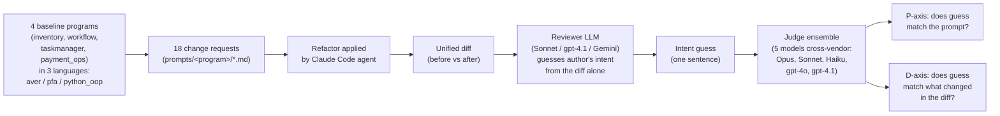

# intent-trace

**An empirical benchmark for how much change-level author intent survives a code diff — measured with an LLM reviewer.**

This repo tests a claim from the [Aver language](https://averlang.dev) project: that **structurally declared intent** (signatures, description markers, decision blocks, verify blocks) makes code legible for AI review without special training on the language.

**What we measure is *intent of the diff*, not *intent of the program*.** The reviewer sees a unified diff between a baseline and a refactored snapshot and has to reconstruct what the author was trying to *change*. This is a different question from "given the full codebase, what does this program do" — Aver may have stronger or weaker properties for whole-program comprehension than this benchmark can show. We deliberately stay in the PR-review frame: reviewer sees the diff, nothing more.

## How it works (in one diagram)



Each combination (program × prompt × language × view) is a "slice." Every slice runs through this pipeline. Higher P+D scores = the reviewer reconstructed intent more accurately from the diff. Aver's claim is that its structural prose (`intent` / `decision` / `?` / `verify`) makes diffs more legible to AI reviewers — this benchmark tests that empirically.

**Three language variants** of each program: `aver` (the original), `pfa` (= `python_from_aver`, faithful transliteration of Aver into Python — same intent structure, just Python syntax + docstrings), and `python_oop` (idiomatic OOP Python — what a Python dev would write naturally, no Aver-style intent declarations).

**Two views per slice**: `full` (diff with all prose visible) and `masked` (prose layer stripped — for Aver: `intent`, `decision`, `?`, `verify`; for Python: docstrings + comments). Comparing full vs masked tells us how much each language's prose layer carries.

Headline findings (differences are mostly 0.01–0.20; rubric noise ~0.3 per cell):

1. **Aver ≈ Aver-in-Python on every reader.** `python_from_aver` (shortened to `pfa` throughout) is a faithful transliteration of Aver — same intent structure, Python as carrier. On Sonnet the gap is 0.01, on gpt-4.1 it's 0.10 (pfa leading), on Gemini 0.23 — all within noise. Idiomatic `python_oop` sits 0.16–0.34 below. Interpretation: intent structure carries legibility; Python's training priors give a hair of directional edge when structure is held constant.

2. **Aver's narrative prose (`intent` / `decision` / `?`) does the work — not `verify`.** Stripping prose makes `aver/masked` the lowest cell on every reader. The follow-up `masked_spec` ablation (strip narrative, keep `verify`) shifts Aver only by +0.02 / −0.05 / −0.21 — inside noise. Verify is spec, not review-time doc.

3. **On `payment_ops` (1300-line multi-module), pfa beats Aver by 0.57 on architectural refactors (+0.71) more than on additive (+0.44).** `python_oop` drops to 7.75 on those same prompts (below Aver 7.92) — heavy docstrings, not Python itself, survive architectural diffs at scale. Gap held after v2 canonical rewrite (not a baseline artifact).

**v2 canonical rerun.** All Aver files pass `aver check`; all pfa files carry matching "Design decisions:" sections and complete docstrings. python_oop code was not touched, so only aver + pfa were rerun — python_oop rows are the v1 results carried over unchanged.

**What this benchmark measures.** How well an LLM reviewer reconstructs the intent of a change from a unified diff — nothing about whole-program comprehension, production readability, or human-in-the-loop review.

## Method in one paragraph

For each `(program, prompt, language, view)` cell, an agent applies the change request to a baseline program, we compute the unified diff, hand it to a **reviewer LLM** (Claude Sonnet 4.6) asking it to guess the author's intent, and score the guess along two axes with a **5-model cross-vendor ensemble** (Claude Opus 4.7 + Sonnet 4.6 + Haiku 4.5 + OpenAI gpt-4o + gpt-4.1, median). Every rubric uses a **0–10 scale with descriptor anchors**. Append-only JSONL output, crash-safe, resumable.

## What we measured

### Two scoring axes per slice

- **Prompt-axis (P)** — how well the reviewer's guess matches the original change request.
- **Diff-axis (D)** — how faithfully the reviewer's guess describes what actually changed in the code.

(A third axis, *change quality*, is also computed per `(prompt, lang)` but is not the primary signal; see `src/intent_trace/judges.py`.)

### Two views per slice

- **full** — the unified diff as a PR reviewer sees it (before/after, 3 lines of context around changes).
- **masked** — same diff, but with the **prose layer stripped**: in Aver that's `intent = …`, `decision …`, `? "…"` descriptions, and `verify …` blocks; in Python that's docstrings and `#` comments. Ablation tells us what each language's prose layer actually transmits.

  **Caveat on `verify` blocks.** Aver `verify` is an executable specification — closer to a Python `assert` than to a docstring. Stripping it therefore mixes "narrative prose" with "spec" in a way that is asymmetric across languages (Python `assert` statements are *not* stripped in the masked view). We ran a follow-up view `masked_spec` that preserves `verify` while still stripping `intent`/`decision`/`?` prose (for Python it's identical to `masked` since `assert` was never stripped — useful as a replication-noise control).
- **masked_spec** — narrative prose stripped, executable spec (`verify`/`assert`) preserved. The difference between `masked` and `masked_spec` isolates how much signal the spec layer carried.

### Three language variants

- **aver** — the original.
- **python_from_aver** — **Aver written in Python.** Same intent structure, same decision decomposition, same function boundaries — just Python syntax as carrier. Frozen dataclasses instead of `record`, pure functions, `replace()`-based updates, docstrings carrying what would be `?` descriptions in Aver, module-level "Design decisions:" sections mirroring Aver `decision` blocks, `assert` where Aver has `verify`. **Crucially: in Aver the prose layer is compiler-enforced (`aver check` fails if `verify` / `intent` coverage is incomplete); in `python_from_aver` the same structure is convention — a maintainer could let it drift and Python wouldn't complain.** The benchmark measures a snapshot where both variants carry matching prose; long-term maintenance under enforcement vs convention is a different question this benchmark doesn't test.
- **python_oop** — an OOP Python design of the same programs (classes with methods, mutation where natural, typed exception hierarchy). Intended as "the Python a Python dev would actually write."

### The three variants, side by side

Same `reserveStock` operation. Full files in `programs/inventory/`; here the minimum to show where they diverge:

**Aver** — `Result<T, E>`, explicit `match`, `? "..."` + `verify` per function. Every design choice is in prose that `aver check` enforces:

```aver
module Inventory
    intent = "Multi-warehouse inventory. Separates available from reserved so pending orders do not over-commit."

decision SeparateAvailableAndReserved
    reason = "Collapsing reserved into available would allow a second reservation to over-commit the same units."
    chosen = "SplitAvailableReserved"
    rejected = ["SingleAvailableCounter"]

fn reserveStock(inv: Inventory, warehouseId: String, skuId: String, qty: Int) -> Result<Inventory, String>
    ? "Reserves qty for an order. Fails if qty would exceed (onHand - reserved)."
    match qty <= 0
        true -> Result.Err("Reserve qty must be positive")
        false -> reserveStockChecked(inv, warehouseId, skuId, qty)

verify reserveStock
    reserveStock(sampleInventory(), "W1", "S1", 0) => Result.Err("Reserve qty must be positive")
    reserveStock(sampleInventory(), "W1", "S1", 3) => Result.Ok(applyReserve(sampleInventory(), "W1", "S1", 3))
```

**Aver-in-Python** — same intent as module docstring + Design decisions section, same function-level prose as docstring, free functions over frozen dataclasses. Current baseline uses `raise` instead of a Result dataclass (loose transliteration). Prose here is convention, not enforced:

```python
"""Multi-warehouse inventory... Design decisions: separate available/reserved
(collapsing would let a second reservation over-commit); errors raised (loose
form — strict Aver-in-Python would return a Result sum type)."""

def reserve_stock(inv, warehouse_id, sku_id, qty) -> Inventory:
    """Reserve qty for an order. Raises if qty would exceed available."""
    if qty <= 0: raise ValueError("Reserve qty must be positive")
    if not known_warehouse(inv, warehouse_id): raise ValueError(f"Unknown warehouse: {warehouse_id}")
    # ... known_sku guard, available guard, return replace(...)
```

**Idiomatic Python** — class with mutation, typed exception hierarchy, private `_require_*` helpers. **Design rationale not stated anywhere** — a reviewer infers from class shape, attribute names, and exception class names:

```python
class Inventory:
    def reserve(self, warehouse_id, sku_id, qty) -> None:
        if qty <= 0: raise NonPositiveQtyError("Reserve")
        self._require_warehouse(warehouse_id)
        self._require_sku(sku_id)
        lvl = self._mutable_level(warehouse_id, sku_id)
        if qty > lvl.available: raise InsufficientStockError(qty, lvl.available)
        lvl.reserved += qty
```

Same guard sequence and state change. Where they diverge is the **intent surface area** that reaches an LLM reviewer from a diff: Aver states every choice in prose (enforced), pfa states the same as docstrings (convention), python_oop states nothing — the reader reconstructs it from shape.

Both Python variants cover the same domains as Aver and their smoke tests pass independently. v1 baselines had inconsistent prose density across programs — v2 canonical rerun addresses this (Aver passes `aver check` with full verify; pfa has matching Design decisions + complete docstrings; python_oop unchanged as control).

## Programs

| program | description | size |
|---|---|---|
| `inventory` | warehouse + SKU + reservations + reorder | ~250 lines Aver, 5 prompts |
| `workflow` | expense-report approval state machine | ~200 lines Aver, 5 prompts |
| `taskmanager` | multi-module (models / validation / projects / tasks / main) | ~400 lines Aver, 4 prompts |
| `payment_ops` | real multi-module domain: webhook normalize, cases, ledger, reconcile, views | ~1300 lines Aver, 4 prompts |

Prompts range from specific refactors ("reject negative prices") to vague directives ("make it harder to lose stock"), including one large architectural change per program.

## Results

**All numbers below use the 5-judge cross-vendor ensemble (Claude Opus 4.7 + Sonnet 4.6 + Haiku 4.5 + OpenAI gpt-4o + gpt-4.1, median), applied to every slice of every reader. v2 canonical baselines (all Aver passes `aver check`; all `python_from_aver` has matching Design decisions docstrings). 486 measured slices total (3 readers × 18 prompts × 3 languages × 3 views: full, masked, masked_spec; N=18 per `(lang, view)` cell).**

### Per-reader ranking (full view, avg = (P+D)/2, v2 canonical)

```
Claude Sonnet 4.6 (reader):
  1. python_from_aver  full    8.61
  2. aver              full    8.60   ← gap 0.01 — genuine parity
  3. python_oop        full    8.26

OpenAI gpt-4.1 (reader):
  1. python_from_aver  full    8.66   ← pfa took lead after canonical rerun
  2. aver              full    8.56
  3. python_oop        full    8.40

Google Gemini 2.5 Flash (reader):
  1. python_from_aver  full    8.35
  2. python_oop        full    8.14
  3. aver              full    8.12   ← aver caught up to python_oop after canonical
```

**pfa takes the top slot on every reader, Aver sits within noise of it on Sonnet (+0.01) and gpt-4.1 (+0.10) and within noise of `python_oop` on Gemini (+0.02).** The idiomatic `python_oop` baseline is clearly below on the two strongest readers (~0.3–0.4 below). Under Gemini, all three variants cluster within 0.23 — consistent with the reader being near its ceiling of reconstruction ability.

### Ranking with 95% bootstrap CIs — all 3 readers


Error bars are 95% bootstrap confidence intervals over the N=18 per-cell slices (10k resamples). Top-of-ranking intervals overlap on every reader — this is the visual form of "parity within noise." (Sonnet-only version with identical data: `results/plots/ranking.png`.)

### Full cross-reader comparison


```
lang/view                Sonnet      gpt-4.1     Gemini
aver/full                8.60 (18)   8.56 (18)   8.12 (18)
aver/masked              8.06 (18)   7.81 (18)   7.66 (18)
aver/masked_spec         8.08 (18)   7.76 (18)   7.45 (18)   ← always lowest
python_from_aver/full    8.61 (18)   8.66 (18)   8.35 (18)
python_from_aver/masked  8.42 (18)   8.12 (18)   7.84 (18)
python_from_aver/masked_spec 8.19 (18) 8.21 (18) 7.56 (18)
python_oop/full          8.26 (18)   8.40 (18)   8.14 (18)
python_oop/masked        8.22 (18)   8.38 (18)   7.89 (18)   ← barely moves
python_oop/masked_spec   8.12 (18)   8.14 (18)   7.88 (18)
```

### Judge × reader grid (who is kind to whom)


### Judge family × language (GPT is kinder to Aver)


### Ablation across all readers


### Judge-family bias

Each judge family scores its own-vendor reader slightly higher, but only by ~0.05 — small vs the ~0.3 noise band. GPT judges are uniformly ~0.1 more lenient than Claude. The bigger effect is **by language**: GPT judges score Aver guesses +0.22 higher than Claude do (vs +0.07 on Python variants) — so adding GPT judges to a Claude-only panel lifted Aver's relative position most.

### Per-program breakdown


Aver's relative position varies with program size: near-parity or small edge on `inventory`/`workflow`/`taskmanager`, clear loss on `payment_ops` (1300 lines). Stratified by diff-type below — the `payment_ops` loss concentrates on architectural refactors, not additive changes.

### Inter-judge agreement (Krippendorff's α)


Pooled α_ordinal: **P-axis 0.54, D-axis 0.28** — both below the 0.67 "tentative" threshold. Judges agree on ranking (pairwise Spearman ρ̄ ≈ 0.60 on P) but not on absolute per-item scores. Aggregate cell means (N=18 × 5 judges = 90 scores per cell) average most of that out — directional comparisons are informative, per-slice claims aren't. D-axis disagreement is the strongest argument for a future human-rater sanity pass.

Per-judge means on Sonnet reader: Opus P=8.33 D=8.61, Sonnet P=7.76 D=8.69, Haiku P=7.86 D=8.81, gpt-4o P=7.53 D=9.36, gpt-4.1 P=7.66 D=9.02. OpenAI judges are stricter on P (−0.3 to −0.4) and more lenient on D (+0.3 to +0.6); biases partly cancel in (P+D)/2.

### Per-axis breakdown


### Ablation — what strip of prose reveals (Sonnet reader, 5-judge)


```
Aver              full → masked   ΔP = -0.94   ΔD = -0.14
Python (from Aver) full → masked   ΔP = -0.50   ΔD = -0.03
Python (OOP)      full → masked   ΔP = -0.06   ΔD = -0.03
```

The pattern replicates across every reader: `aver/masked` is the lowest-scoring cell of all six under Sonnet (8.07), gpt-4.1 (7.79), and Gemini (7.43). Aver concentrates intent in prose that a reviewer cannot reconstruct from the code alone. Idiomatic OOP Python has very little to lose.

### Per diff-type — where Aver's payment_ops loss actually lives


18 prompts hand-classified: architectural (6), additive (9), data-model (2), vague (1). On payment_ops split:

| category | aver | pfa | python_oop | Δ pfa−aver |
|---|---:|---:|---:|---:|
| architectural | 7.92 | 8.62 | 7.75 | **+0.71** |
| additive | 8.42 | 8.86 | 8.42 | +0.44 |

Aver's payment_ops loss concentrates on architectural refactors — where both Aver and idiomatic OOP Python struggle (7.92 and 7.75), and only heavy-doc `python_from_aver` survives (8.62). On additive prompts the gap halves.

### Verify-preserving ablation (`masked_spec` vs `masked`)


Addresses an asymmetry concern: `masked` strips Aver's `verify` blocks even though they're executable spec (like Python `assert`, which isn't stripped). `masked_spec` keeps `verify`, strips narrative only. Aver `masked → masked_spec` deltas: +0.02 / −0.05 / −0.21 across Sonnet / gpt-4.1 / Gemini — inside the ±0.25 replication-noise band (python_oop control swings −0.01 to −0.24 on identical inputs). **Verify is spec, not review-time doc** — the legibility drop comes from narrative prose (`intent`/`decision`/`?`), not from `verify`.

## Findings

Read these as statements about the specific setup described above — 3 reader families, 5 judge models spanning 3 vendors, 3 agent-generated baselines, 18 prompts across 4 programs — not as universal claims.

1. **Aver ≈ Aver-in-Python on strong readers, within rubric noise.** Sonnet: pfa 8.61 vs aver 8.60 (gap 0.01). gpt-4.1: pfa 8.66 vs aver 8.56 (0.10). Both below the ~0.3 noise band — parity within noise, with a small directional edge for pfa (carrier-language training priors). Aver sits 0.16–0.34 above idiomatic `python_oop` on the same readers. Under Gemini Flash, pfa leads by 0.23 and all three variants drop — reader-capability ceiling, not language bias.

2. **"Home-field advantage" was mostly a judge-panel artifact.** A 3-judge Claude-only panel had gpt-4.1 rank python_oop first (8.50) and Aver third (8.36). Swapping in a 5-judge cross-vendor panel gave pfa 8.66 > aver 8.56 > python_oop 8.40. Judge-family preference for own-vendor reader is only +0.06. GPT judges also score Aver guesses +0.22 higher than Claude do (vs +0.07 on Python variants) — the main reason the panel swap reshuffled the top.

3. **Aver's signal lives in the narrative prose, not in `verify`.** Strip `intent` / `decision` / `?` / `verify` and Aver drops the most of any variant — `aver/masked` is the lowest-scoring cell on every reader. A follow-up `masked_spec` ablation (preserving `verify`, stripping only narrative) shifts Aver by +0.02 / −0.05 / −0.21 across readers — inside the ±0.25 replication-noise band. **Verify blocks are executable spec, not review-time doc.** The narrative prose (`intent` / `decision` / `?`) is the whole legibility story for diff review.

4. **Aver's large-program loss concentrates on architectural refactors, survives canonical rerun.** On `payment_ops`, Aver's gap vs pfa is +0.71 on architectural prompts but only +0.44 on additive. `python_oop` drops to 7.75 on those same architectural prompts, below Aver's 7.92 — so "heavy-doc Python beats Aver at scale" is really "heavy docstrings survive architectural refactors at scale; Aver and idiomatic OOP Python both struggle there, together." Not a baseline artifact: the gap held after v2 canonical rewrite.

5. **Per-item inter-judge agreement is low** (α ≈ 0.54 on P-axis, ≈ 0.28 on D-axis — both below the 0.67 "tentative" threshold). Judges agree on *ranking* (pairwise Spearman ρ̄ ≈ 0.60 on P) but not on absolute per-item score. Aggregate cell means average most of that out (bootstrap CIs on the ranking chart), but fine-grained per-slice claims aren't trustworthy. Human raters on a stratified subsample is the single cleanest remaining improvement — currently the strongest threat.

## Why this experiment even exists

[Aver's thesis](https://averlang.dev) is that code must be **legible to an AI reviewer** — that the artifact carries intent so a reviewer (human or AI) can reconstruct it without prior familiarity. This benchmark operationalizes that claim: we treat an LLM as the reviewer, measure how much intent it can reconstruct from each artifact style, and compare across training-exposure asymmetries.

The headline, stated cautiously: **Aver's structural intent declarations (`intent`, `decision`, `?`, `verify`) read within rubric noise of a faithful Python transliteration carrying the same intent as docstrings** — on every reader, on full view. The Python transliteration has a tiny directional edge (+0.01 to +0.10 on strong readers) which we attribute to carrier-language training priors; with zero Aver training exposure this near-parity is notable. At 1300 lines of multi-module domain code, paragraph-scale Python docstrings pull ahead clearly on architectural refactors, though this finding survived the v2 canonical rerun and is robust to baseline drift. The prose layer is load-bearing across the board — masked Aver is the weakest cell on every reader — so the open question is whether richer module-level `intent` declarations can close the large-program architectural gap.

## Scope and threats to validity

These are split into **scope** (what this benchmark does and doesn't measure — not validity issues, just boundaries) and **validity threats** (reasons the numbers inside the measured scope may still be wrong).

### Scope — what we are and aren't measuring

- **Diff review, not program comprehension.** We measure how well a reviewer reconstructs the *intent of a change* from a unified diff. We do not measure how well a reviewer understands the *intent of a whole program* given its full source. Aver has affordances for whole-program understanding (module `intent`, `decision` blocks, `aver context` tool) that this benchmark simply does not exercise. A Python-OOP program with a terse diff may still be harder to understand at the program level than an Aver program — that's a different, un-tested question.
- **Small domain coverage.** Four programs, 18 prompts total. Three are small/medium invented domains (inventory, workflow, taskmanager); one is a real-world multi-module domain (payment_ops, ~1300 lines). Typical enterprise codebases are 10k+ lines across dozens of modules; behavior at that scale is not tested.
- **Agent-produced refactors, not human commits.** Both the baselines and the refactors were generated by sub-agents (Claude Code) applying the change requests. Real open-source commits from human developers would reduce construct bias, but require domain-matched Aver corpora that don't yet exist.
- **`aver context` not exercised.** We initially ran an `aver_context` view (diffing compressed intent summaries) but concluded the setup was synthetic — `aver context` is a state-projection tool, not a change-representation tool, and diffing two projections doesn't match how reviewers actually use the tool. Scores collapsed in complex multi-module code for structural (not legibility) reasons. Code path dropped.

### Validity threats — reasons the measured numbers may be wrong

1. **Baseline inconsistency across programs — addressed in v2 canonical rerun.** pfa originally drifted (snake_case / camelCase mixed, docstring density 50–93%) and Aver before-files were missing `verify` coverage. v2 rewrote everything to canonical (Aver passes `aver check`, pfa has matching Design decisions + complete docstrings) and rerun only aver + pfa (python_oop code unchanged, so its v1 rows were carried over — no rerun). Headline #2 survived. Residual confound: docstring volume vs format (open follow-up: pfa trimmed to Aver-prose-volume).

2. **N=18 per cell is small.** Rubric noise ~0.3 per cell, per-cell gaps often in 0.01–0.20. None of these differences are statistically strong except the 0.71 payment_ops architectural gap. Bootstrap CIs on the ranking chart make this visible.

3. **Inter-judge agreement is low** (α ≈ 0.54 P-axis, 0.28 D-axis). See Finding #5. Human raters on a stratified subsample would be the strongest remaining improvement.

4. **Gemini 2.5 Flash is the weakest reader** (~0.3–0.7 below Sonnet and gpt-4.1). Looks like capability ceiling, not language bias — a Gemini-Pro rerun would clarify.

## Reproduce

```bash
# Install + API keys
uv sync
# .env needs: ANTHROPIC_API_KEY, OPENAI_API_KEY, GOOGLE_API_KEY

# Full pipeline for one reader (LLM-B = INTENT_TRACE_MODEL_B env var)
INTENT_TRACE_MODEL_B=claude-sonnet-4-6 \
  uv run --env-file .env scripts/run_all.py
# (swap for gpt-4.1 or gemini-2.5-flash to produce the other reader datasets)

# Cross-vendor 4th/5th judges on an existing run (reuse diffs+guesses)
INTENT_TRACE_JUDGE_GPT=gpt-4o uv run --env-file .env \
  scripts/add_gpt_judge.py results/ensemble_YYYYMMDD_HHMMSS/slices.jsonl
INTENT_TRACE_JUDGE_GPT=gpt-4.1 uv run --env-file .env \
  scripts/add_gpt_judge.py <above output>/slices.jsonl

# Merge resume runs into canonical per-reader JSONL
uv run python scripts/merge_judge_runs.py            # → results/merged/{sonnet,gpt4.1,gemini}.jsonl
# Fill judges that a prior run missed (e.g. 503s)
uv run --env-file .env python scripts/fill_missing_judges.py all
# Re-run LLM-B + 5 judges on slices a reader skipped
uv run --env-file .env python scripts/fill_missing_slices.py gemini

# Plots
uv run python scripts/plot_results.py     # ranking, axes, ablation, 3-way reader
uv run python scripts/plot_heatmaps.py    # reader × program × lang × view heatmaps
```

## Layout

```
programs/<program>/
  aver/before/*.av                           # original Aver baseline
  aver/after/<prompt>/*.av                   # refactor applied by agent
  python_from_aver/before/*.py               # Aver-translated-style Python baseline
  python_from_aver/after/<prompt>/*.py
  python_oop/before/*.py                     # independent OOP Python baseline
  python_oop/after/<prompt>/*.py
prompts/<program>/*.md                       # change request per prompt

src/intent_trace/
  judges.py                                  # 3 rubrics + ensemble median
  mask.py                                    # prose-stripping for ablation

scripts/
  run_all.py                                 # pipeline entrypoint (LLM-B + judges)
  add_gpt_judge.py                           # append a cross-vendor judge to a finished run
  fill_missing_judges.py                     # patch missing GPT judges on merged datasets
  fill_missing_slices.py                     # re-run LLM-B + 5 judges for slices a reader dropped
  merge_judge_runs.py                        # collapse resume runs into one canonical JSONL per reader
  plot_results.py                            # ranking / axes / ablation / 3-way reader charts
  plot_heatmaps.py                           # reader × program × lang × view heatmaps

results/ensemble_<timestamp>/                # raw pipeline outputs (one per reader × model-B run)
  meta.json                                  # plan + model IDs
  slices.jsonl                               # one slice per line (append-only, crash-safe)
  SUCCESS                                    # marker after clean finish
results/gpt_added_<timestamp>/               # add_gpt_judge.py outputs
results/merged/<reader>.jsonl                # canonical per-reader dataset (deduped, 5-judge)
```

## Status

Dataset is complete (v2 canonical rerun): 3 readers × 162 slices × 5 judges × 2 axes = 4860 judgments. N=18 per `(lang, view)` cell on every reader. python_oop rows are v1 carried over (code was not touched by canonical rewrite — only aver + pfa were rerun). Findings above are stable under ensemble noise (~1 point spread on prompt-axis, 0–1 on diff-axis). PRs welcome to add languages, models, or programs.

## License

MIT.
