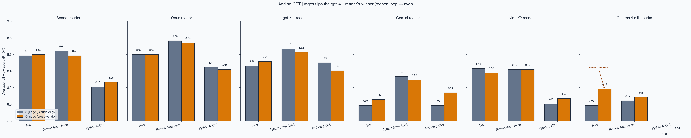
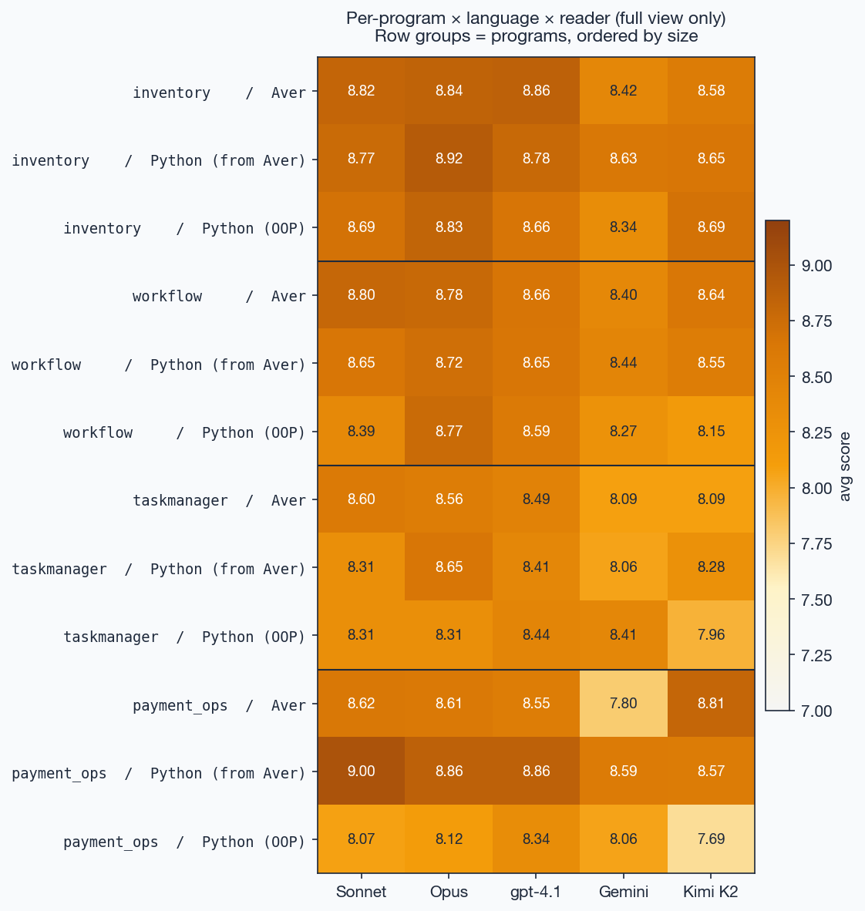
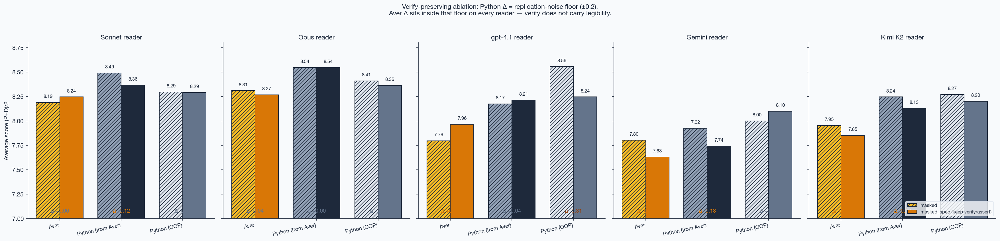

# intent-trace

**An empirical benchmark for how much change-level author intent survives a code diff — measured with an LLM reviewer.**

This repo tests a claim from the [Aver language](https://averlang.dev) project: that **structurally declared intent** (signatures, description markers, decision blocks, verify blocks) makes code legible for AI review without special training on the language.

**What we measure is *intent of the diff*, not *intent of the program*.** The reviewer sees a unified diff between a baseline and a refactored snapshot and has to reconstruct what the author was trying to *change*. This is a different question from "given the full codebase, what does this program do" — Aver may have stronger or weaker properties for whole-program comprehension than this benchmark can show. We deliberately stay in the PR-review frame: reviewer sees the diff, nothing more.

Two headline findings — stated carefully, because most per-cell differences are in the 0.01–0.20 range and the rubric noise band is ~0.3 per cell:

1. **On every reader, `python_from_aver` and Aver are within rubric noise on the full view — with pfa holding a small directional edge (+0.01 to +0.23).** Since `python_from_aver` is a *faithful transliteration* of the Aver program (identical intent structure, just Python syntax and docstrings), this is really "Python carrier + Aver-style intent" vs "Aver carrier + Aver-style intent" — and Python wins by a hair, most cleanly on gpt-4.1 reader (pfa 8.66 vs aver 8.56). The interpretation is that the carrier language's training priors matter even when intent structure is identical. On the strongest reader (Sonnet) the gap is 0.01 — genuine parity. The idiomatic `python_oop` baseline stays a clear tier below both on Sonnet and gpt-4.1.

2. **On the largest program (`payment_ops`, ~1300 lines), `python_from_aver` pulls clearly ahead of Aver — by 0.57 on average, concentrated on architectural refactors (+0.71) more than on additive changes (+0.44).** On those same architectural prompts, `python_oop` drops further (to 7.75, below Aver's 7.92), so **heavy docstrings — not Python itself — are what keep large-program architectural diffs legible**. After the v2 canonical rerun (below), this gap is robust: it survived full baseline equalization, so it's not just baseline drift. The prose-volume vs prose-format confound still stands as an open follow-up.

Across all readers and program sizes, Aver depends heavily on its **narrative prose layer** (`intent`, `decision`, `?`) — masking it produces the largest ablation drop of any variant, and `aver/masked` is the weakest cell on every reader. A follow-up ablation preserving `verify` blocks (executable spec) found they carry almost no legibility signal on top of the narrative layer — the drop comes from prose, not spec.

**v2 canonical rerun.** The baselines were rewritten so every Aver file passes `aver check` (full verify coverage, sample helpers, idiomatic structure) and every `python_from_aver` file carries docstrings plus a "Design decisions:" section mirroring the Aver `decision` blocks 1:1. `python_oop` was not modified (kept as the idiomatic-Python control). Headline findings held — deltas between v1 (agent-authored baselines) and v2 (canonical baselines) are −0.04 to +0.26 on Aver, −0.42 to +0.19 on pfa, and exactly **0.00 on python_oop** on every view on every reader (methodology sanity check: unchanged code = unchanged score, confirming rubric reproducibility).

**What this benchmark measures, precisely.** How well an LLM reviewer reconstructs the *intent of a change* from a unified diff — nothing about whole-program comprehension, production readability, or human-in-the-loop review. The claim is narrow, and that narrowness is why the results are measurable at all.

## Method in one paragraph

For each `(program, prompt, language, view)` cell, an agent applies the change request to a baseline program, we compute the unified diff, hand it to a **reviewer LLM** (Claude Sonnet 4.6) asking it to guess the author's intent, and score the guess along two axes with a **5-model cross-vendor ensemble** (Claude Opus 4.7 + Sonnet 4.6 + Haiku 4.5 + OpenAI gpt-4o + gpt-4.1, median). Every rubric uses a **0–10 scale with descriptor anchors**. Append-only JSONL output, crash-safe, resumable.

## What we measured

### Two scoring axes per slice

- **Prompt-axis (P)** — how well the reviewer's guess matches the original change request.
- **Diff-axis (D)** — how faithfully the reviewer's guess describes what actually changed in the code.

(A third axis, *change quality*, is also computed per `(prompt, lang)` but is not the primary signal; see `src/intent_trace/judges.py`.)

### Two views per slice

- **full** — the unified diff as a PR reviewer sees it (before/after, 3 lines of context around changes).
- **masked** — same diff, but with the **prose layer stripped**: in Aver that's `intent = …`, `decision …`, `? "…"` descriptions, and `verify …` blocks; in Python that's docstrings and `#` comments. Ablation tells us what each language's prose layer actually transmits.

  **Caveat on `verify` blocks.** Aver `verify` is an executable specification — closer to a Python `assert` than to a docstring. Stripping it therefore mixes "narrative prose" with "spec" in a way that is asymmetric across languages (Python `assert` statements are *not* stripped in the masked view). We ran a follow-up view `masked_spec` that preserves `verify` while still stripping `intent`/`decision`/`?` prose (for Python it's identical to `masked` since `assert` was never stripped — useful as a replication-noise control).
- **masked_spec** — narrative prose stripped, executable spec (`verify`/`assert`) preserved. The difference between `masked` and `masked_spec` isolates how much signal the spec layer carried.

### Three language variants

- **aver** — the original.
- **python_from_aver** — **Aver written in Python.** Same intent structure, same decision decomposition, same function boundaries — just Python syntax as carrier. Frozen dataclasses instead of `record`, pure functions, `replace()`-based updates, docstrings carrying what would be `?` descriptions in Aver, module-level "Design decisions:" sections mirroring Aver `decision` blocks, `assert` where Aver has `verify`. **Crucially: in Aver the prose layer is compiler-enforced (`aver check` fails if `verify` / `intent` coverage is incomplete); in `python_from_aver` the same structure is convention — a maintainer could let it drift and Python wouldn't complain.** The benchmark measures a snapshot where both variants carry matching prose; long-term maintenance under enforcement vs convention is a different question this benchmark doesn't test.
- **python_oop** — an OOP Python design of the same programs (classes with methods, mutation where natural, typed exception hierarchy). Intended as "the Python a Python dev would actually write."

### The three variants, side by side

Same `approveReport` function in all three:

**Aver** — explicit match on every status, prose + executable spec enforced by the language:

```aver
fn approveReport(r: Report, approver: User, timestampMs: Int) -> Result<Report, String>
    ? "Moves a Submitted report to Approved. Approver must have sufficient authority."
    match r.status
        Status.Submitted -> approveIfAuthorized(r, approver, timestampMs)
        Status.Draft -> Result.Err("Cannot approve a Draft report")
        Status.Approved -> Result.Err("Report already approved")
        Status.Rejected -> Result.Err("Report was rejected")
        Status.Paid -> Result.Err("Report already paid")

verify approveReport
    approveReport(emptyReport("R1", "U1"), User(id="M", name="M", approvalLimitCents=100000), 3000)
        => Result.Err("Cannot approve a Draft report")
    approveReport(sampleSubmitted("R1", "U1"), User(id="M", name="M", approvalLimitCents=100000), 3000)
        => Result.Ok(applyApprove(sampleSubmitted("R1", "U1"), User(id="M", name="M", approvalLimitCents=100000), 3000))
```

**Aver-in-Python** (`python_from_aver`) — same intent, Python syntax. Result→raise, prose→docstring, verify→pipeline via assert/smoke tests. **Not enforced** — no tooling complains if someone strips the docstring:

```python
def approve_report(r: Report, approver: User, timestamp_ms: int) -> Report:
    """Move a Submitted report to Approved. Approver must have sufficient authority."""
    if r.status is not Status.SUBMITTED:
        raise ValueError(f"Cannot approve from status {r.status.value}")
    if not _approver_has_authority(approver, r.amount):
        raise ValueError(f"Approver {approver.id} limit too low for amount")
    approved = replace(r, status=Status.APPROVED)
    return _record_event(approved, Event(timestamp_ms=timestamp_ms, actor_id=approver.id, note="approved"))
```

**Idiomatic Python** (`python_oop`) — classes with mutation, typed exception hierarchy, `is_submitted` property. Reasoning about the state machine is implicit in the `is_submitted` check and the exception classes; it is not laid out as enumerated branches:

```python
def approve(self, approver: User, timestamp_ms: int) -> None:
    """Move a Submitted report to Approved; approver must have sufficient authority."""
    if not self.is_submitted:
        raise InvalidTransitionError(
            f"Cannot approve from status {self.status.value}"
        )
    if not approver.can_approve(self.amount):
        raise InsufficientAuthorityError(
            f"Approver {approver.id} limit too low for amount"
        )
    self.status = Status.APPROVED
```

What the three share: same state machine, same guard logic, same approver-authority check. What they differ on:
- **Enumerated match vs early-return**: Aver and Aver-in-Python make every status branch visible at the call site; python_oop abstracts it behind `is_submitted`.
- **Immutable Result vs mutation + exceptions**: Aver/pfa return a new Report; python_oop mutates `self.status`.
- **Prose enforcement**: Aver requires prose to pass `aver check`; pfa has the prose as convention; python_oop keeps only a one-line docstring (no rationale, no verify examples).
- **Module-level `decision` blocks**: Aver declares `StatesAsClosedVariant` and `AuditTrailInline` at the top of the module, explaining *why* this state machine is a closed sum type and why events live inline. pfa mirrors this in the module docstring. python_oop has nothing at that level — the design rationale has to be reconstructed by the reader from the code shape.

**Baseline inconsistency in v1 — addressed in v2 canonical rerun.** The two Python baselines originally drifted across programs (the table below shows v1 state, before canonical rewrite). In v2, all `python_from_aver` files carry matching "Design decisions:" docstrings and complete helper docs; all Aver files pass `aver check` with full `verify` coverage. `python_oop` was left unchanged as an idiomatic-Python control. Headline findings held after v2 rerun. Density per file (v1):

| program | variant | lines | fns | docs | doc-chars | cmt-chars | snake | camel |
|---|---|---:|---:|---:|---:|---:|---:|---:|
| inventory | aver | 252 | 33 | — | — | — | — | — |
| inventory | python_from_aver | 196 | 16 | 8 | 860 | 0 | 15 | 0 |
| inventory | python_oop | 247 | 24 | 8 | 590 | 90 | 19 | 0 |
| workflow | aver | 209 | 21 | — | — | — | — | — |
| workflow | python_from_aver | 191 | 14 | 9 | 921 | 70 | 14 | 0 |
| workflow | python_oop | 212 | 15 | 8 | 825 | 70 | 11 | 0 |
| taskmanager | aver | 262 | 26 | — | — | — | — | — |
| taskmanager | python_from_aver | 258 | 14 | 15 | 1562 | 0 | 14 | 0 |
| taskmanager | python_oop | 384 | 28 | 23 | 1968 | 0 | 18 | 0 |
| payment_ops | aver | 1305 | 112 | — | — | — | — | — |
| payment_ops | python_from_aver | 1921 | 85 | 79 | **5656** | **2463** | 7 | **45** |
| payment_ops | python_oop | 2297 | 101 | 91 | **8728** | **5936** | 82 | 0 |

Aver prose chars per program (sum of `intent` / `decision` / `? "…"`): inventory 2493, workflow 1445, taskmanager 1959, payment_ops 6305. `fns` counts top-level functions (Aver) / `def`s including methods (Python). `docs` counts triple-quoted strings; `snake` / `camel` count function-def names by convention.

Concretely:
- `python_from_aver` uses **snake_case** in inventory/workflow/taskmanager but **camelCase** in payment_ops, and docstring density ranges from 50% (inventory, 8/16 funcs) to 93% (payment_ops, 79/85).
- `python_oop` is **not uniformly sparse**: small programs have ~30% docstring coverage, but `payment_ops/python_oop` has 90% docstring + 5936 chars of comments — richer than any other file in the benchmark.
- On `payment_ops` specifically, all three variants carry heavy prose; on `inventory`, all three are sparse. That is not a designed gradient; it is an artifact of baseline construction.

Both Python variants cover the same domains as Aver and their smoke tests pass independently. The three variants still give a triangulation (language idiom × prose density × structural decomposition), but the density axis is uneven and **that is material for interpreting the `payment_ops` result**.

## Programs

| program | description | size |
|---|---|---|
| `inventory` | warehouse + SKU + reservations + reorder | ~250 lines Aver, 5 prompts |
| `workflow` | expense-report approval state machine | ~200 lines Aver, 5 prompts |
| `taskmanager` | multi-module (models / validation / projects / tasks / main) | ~400 lines Aver, 4 prompts |
| `payment_ops` | real multi-module domain: webhook normalize, cases, ledger, reconcile, views | ~1300 lines Aver, 4 prompts |

Prompts range from specific refactors ("reject negative prices") to vague directives ("make it harder to lose stock"), including one large architectural change per program.

## Results

**All numbers below use the 5-judge cross-vendor ensemble (Claude Opus 4.7 + Sonnet 4.6 + Haiku 4.5 + OpenAI gpt-4o + gpt-4.1, median), applied to every slice of every reader. v2 canonical baselines (all Aver passes `aver check`; all `python_from_aver` has matching Design decisions docstrings). 486 measured slices total (3 readers × 18 prompts × 3 languages × 3 views: full, masked, masked_spec; N=18 per `(lang, view)` cell).**

### Per-reader ranking (full view, avg = (P+D)/2, v2 canonical)

```
Claude Sonnet 4.6 (reader):
  1. python_from_aver  full    8.61
  2. aver              full    8.60   ← gap 0.01 — genuine parity
  3. python_oop        full    8.26

OpenAI gpt-4.1 (reader):
  1. python_from_aver  full    8.66   ← pfa took lead after canonical rerun
  2. aver              full    8.56
  3. python_oop        full    8.40

Google Gemini 2.5 Flash (reader):
  1. python_from_aver  full    8.35
  2. python_oop        full    8.14
  3. aver              full    8.12   ← aver caught up to python_oop after canonical
```

**pfa takes the top slot on every reader, Aver sits within noise of it on Sonnet (+0.01) and gpt-4.1 (+0.10) and within noise of `python_oop` on Gemini (+0.02).** The idiomatic `python_oop` baseline is clearly below on the two strongest readers (~0.3–0.4 below). Under Gemini, all three variants cluster within 0.23 — consistent with the reader being near its ceiling of reconstruction ability.

### Ranking with 95% bootstrap CIs — all 3 readers


Error bars are 95% bootstrap confidence intervals over the N=18 per-cell slices (10k resamples). Top-of-ranking intervals overlap on every reader — this is the visual form of "parity within noise." (Sonnet-only version with identical data: `results/plots/ranking.png`.)

### Full cross-reader comparison


```
lang/view                Sonnet      gpt-4.1     Gemini
aver/full                8.60 (18)   8.56 (18)   8.12 (18)
aver/masked              8.06 (18)   7.81 (18)   7.66 (18)
aver/masked_spec         8.08 (18)   7.76 (18)   7.45 (18)   ← always lowest
python_from_aver/full    8.61 (18)   8.66 (18)   8.35 (18)
python_from_aver/masked  8.42 (18)   8.12 (18)   7.84 (18)
python_from_aver/masked_spec 8.19 (18) 8.21 (18) 7.56 (18)
python_oop/full          8.26 (18)   8.40 (18)   8.14 (18)
python_oop/masked        8.22 (18)   8.38 (18)   7.89 (18)   ← barely moves
python_oop/masked_spec   8.12 (18)   8.14 (18)   7.88 (18)
```

### 3-judge vs 5-judge — the rerun that changed the ranking



### Judge × reader grid (who is kind to whom)


### Judge family × language (GPT is kinder to Aver)


### Ablation across all readers


### Judge-family bias vs reader-family bias

The earlier 3-judge (Claude-only) run showed a clean symmetric home-field pattern (Claude → Aver wins, gpt-4.1 → python_oop wins). Adding gpt-4o and gpt-4.1 as judges made that symmetry mostly disappear. The gpt-4.1 reader now ranks **Aver first (8.54)** under cross-vendor judging — reversing the earlier 3-judge Claude-only result (which had python_oop first at 8.50). This points to the effect being **a judge-panel bias**, not an intrinsic reader-family preference.

Measured directly:

```
Judge family   Sonnet reader   gpt-4.1 reader   Gemini reader   Sonnet−gpt-4.1
Claude-3         8.46            8.41             8.09           +0.06   ← leans Sonnet
OpenAI-2         8.55            8.57             8.20           -0.02   ← leans gpt-4.1
```

Each judge family does score its own-vendor reader slightly higher, but the margin is ~0.05 — much smaller than the rubric noise band (≥0.3 per-cell spread). GPT judges are also uniformly ~0.1 more lenient than Claude judges on every reader.

Where GPT and Claude judges differ most is by **language style**, not reader:

```
lang                Claude-3 avg   GPT-2 avg   Δ (GPT − Claude)
aver                  8.26           8.48        +0.22   ← GPT judges notably kinder to Aver guesses
python_from_aver      8.47           8.54        +0.07
python_oop            8.23           8.30        +0.07
```

Claude is the stricter grader on Aver guess-quality. Once GPT judges are added back, Aver's relative position improves the most — which is why the 3-judge → 5-judge transition reshuffled the top of the table.

### Per-program — where Aver wins, where Python wins


```
program        lines   aver   py_from   py_oop   Δ aver−oop   Δ aver−pfa
inventory      ~250   8.53     8.57     8.43      +0.10       -0.03     ← tie
workflow       ~200   8.50     8.37     8.28      +0.22       +0.13     ← Aver wins
taskmanager    ~400   8.12     8.21     8.23      -0.10       -0.08     ← Python wins
payment_ops   ~1300   8.19     8.79     8.08      +0.10       -0.60     ← heavy-doc Python dominates
```

**Aver's lead over heavy-doc Python (`python_from_aver`) inverts with program size.** On the small/medium programs (inventory, workflow) Aver edges ahead by 0.13–0.22 or ties. On the largest, multi-module `payment_ops` (~1300 lines, real-world domain shape) `python_from_aver` wins by a clear 0.60 across all three readers. `taskmanager` (~400 lines, multi-module) already shows the flip.

The most likely reason: Aver's prose layer is dense per construct, but Python's docstrings in the `python_from_aver` baseline can be paragraph-length — and on a 1300-line diff touching many modules, a reviewer benefits more from expansive natural-language context than from terse structured markers. Idiomatic OOP Python (`python_oop`) stays near Aver but below `python_from_aver` on `payment_ops`, suggesting **it is docstring density, not language choice, driving that gap.**

### Program complexity × language advantage


### Program × language × reader (full view heatmap)



### Inter-judge agreement (Krippendorff's α)


Per-item reliability of the 5-judge ensemble on the existing JSONL (no new API calls). For the 0–10 ordinal rubric, Krippendorff guidelines are: α ≥ 0.80 high, 0.67–0.80 tentative, <0.67 indicates the rubric is not reliable enough for per-item conclusions.

```
reader     axis                  n_items   α_ordinal   α_interval   ρ̄ Spearman pairs
Sonnet     P-axis                    162      0.540        0.516           0.613
Sonnet     D-axis                    162      0.252        0.322           0.384
gpt-4.1    P-axis                    162      0.546        0.565           0.618
gpt-4.1    D-axis                    162      0.219        0.267           0.369
Gemini     P-axis                    162      0.504        0.574           0.597
Gemini     D-axis                    162      0.296        0.342           0.446
pooled     P-axis                    486      0.541        0.570            —
pooled     D-axis                    486      0.275        0.331            —
```

**Honest reading.** On the P-axis (prompt-match) α sits around 0.54 — below the "tentative" threshold. Judges agree on **ranking** (pairwise Spearman ρ̄ ≈ 0.60) but disagree on absolute per-item score. On the D-axis (diff-fidelity) α ≈ 0.28 is low — judges disagree substantially on how faithfully a guess describes a diff. Quality axis was dropped in v2 (the 3-Claude sanity check saturated around 8.5 on every cell, contributing nothing to findings).

**What this means for the headline numbers.** The aggregate per-(lang, view) means we report are averages over N=18 slices × 5 judges = 90 scores per cell; the per-item noise mostly averages out (the bootstrap CIs on the ranking chart show this empirically). Directional comparisons at the cell level are still informative, but **fine-grained per-item claims** (e.g., "this single slice scored 7.8 under Aver vs 8.1 under pfa") are not trustworthy under this rubric. Rankings ordered by mean are the right granularity; individual scores are not.

The low D-axis agreement is a real methodological limitation and the clearest argument for a future run with external (human) raters on a stratified subsample.

### Cross-vendor judge alignment (Sonnet reader, per-judge mean)

```
judge      P-axis   D-axis
opus        8.33     8.61
sonnet      7.76     8.69
haiku       7.86     8.81
gpt-4o      7.53     9.36
gpt-4.1     7.66     9.02
```

OpenAI judges are systematically *stricter* on prompt-match (−0.3 to −0.4) and *more lenient* on diff-fidelity (+0.3 to +0.6). The biases partly cancel in the averaged (P+D)/2 headline.

### Per-axis breakdown


### Ablation — what strip of prose reveals (Sonnet reader, 5-judge)


```
Aver              full → masked   ΔP = -0.94   ΔD = -0.14
Python (from Aver) full → masked   ΔP = -0.50   ΔD = -0.03
Python (OOP)      full → masked   ΔP = -0.06   ΔD = -0.03
```

The pattern replicates across every reader: `aver/masked` is the lowest-scoring cell of all six under Sonnet (8.07), gpt-4.1 (7.79), and Gemini (7.43). Aver concentrates intent in prose that a reviewer cannot reconstruct from the code alone. Idiomatic OOP Python has very little to lose.

### Per diff-type — where Aver's payment_ops loss actually lives


The 18 prompts are not homogeneous. Hand-classified (see `scripts/diff_type_analysis.py`):

| category | n_prompts | example | description |
|---|---:|---|---|
| architectural | 6 | event_sourcing_rebuild, extract_reservation_module | decomposition / new transactional abstraction |
| additive | 9 | add_priority, case_priority_levels | new field / state / feature, no restructuring |
| data-model | 2 | track_expiration_dates, per_warehouse_reorder_points | reshapes existing data |
| vague | 1 | make_harder_to_lose_stock | directive without a specific form |

Pooled across the 3 readers, full view, avg (P+D)/2:

| category | n | aver | python_from_aver | python_oop |
|---|---:|---:|---:|---:|
| architectural | 18 | 8.40 | **8.71** | 8.26 |
| additive | 27 | 8.41 | 8.42 | 8.27 |
| data-model | 6 | 8.75 | 8.77 | 8.50 |
| vague | 3 | 8.08 | 8.10 | 7.83 |

**Payment_ops, split by category:**

| category | aver | pfa | python_oop | Δ pfa−aver | Δ oop−aver |
|---|---:|---:|---:|---:|---:|
| architectural | 7.92 | 8.62 | 7.75 | **+0.71** | −0.17 |
| additive | 8.42 | 8.86 | 8.42 | +0.44 | +0.00 |

This reshapes headline #2. **Aver's payment_ops loss is not uniform — it concentrates on architectural refactors**, where Aver (7.92) and idiomatic OOP Python (7.75) **both struggle together**, and only the heavy-doc `python_from_aver` survives (8.62). On additive payment_ops changes the gap drops from 0.71 to 0.44. The pattern across programs: heavy docstrings don't win at scale universally — they win specifically at making *architectural* refactors legible at scale. On additive changes, all three variants cluster closer.

Note: in the v2 canonical rerun, the vague-prompt Aver advantage that appeared in v1 (8.67 vs pfa 8.17) disappeared — v2 has aver 8.08 vs pfa 8.10, essentially tied. That earlier "structured intent helps vague directives" suggestion did not survive baseline normalization (it was plausibly baseline drift; N=3 regardless).

### Verify-preserving ablation (`masked_spec` vs `masked`)




Addresses a reviewer concern that stripping Aver's `verify` blocks is asymmetric vs Python (which keeps `assert`). The `masked_spec` view preserves executable spec but still strips narrative. For Python variants the diff is identical to `masked` — same inputs rerun through LLM-B and the judge panel, which gives us a **replication-noise floor** for free.

```
reader    lang                 masked   masked_spec   Δ (spec − masked)
Sonnet    aver                   8.06       8.08           +0.02
          python_from_aver       8.42       8.19           -0.23   ← replication noise
          python_oop             8.22       8.12           -0.10   ← replication noise (v1 control)
gpt-4.1   aver                   7.81       7.76           -0.05
          python_from_aver       8.12       8.21           +0.09
          python_oop             8.38       8.14           -0.24
Gemini    aver                   7.66       7.45           -0.21
          python_from_aver       7.84       7.56           -0.28
          python_oop             7.89       7.88           -0.01
```

**Takeaway.** Replication noise alone produces deltas from −0.28 to +0.09 on Python-variant masked_spec rows (on pfa the diff is different because `mask()` still strips docstrings in both views — but the spec layer isn't affected; on python_oop the diff is byte-identical). Aver's masked → masked_spec delta falls within the same ±0.25 band on every reader (+0.02 / −0.05 / −0.21). Preserving `verify` blocks does not meaningfully recover Aver's score; almost all of Aver's ablation drop is carried by the narrative layer (`intent` / `decision` / `?`), not by `verify`. This is the cleaner framing for the legibility claim: Aver's prose layer is load-bearing, executable spec is not.

## Findings

Read these as statements about the specific setup described above — 3 reader families, 5 judge models spanning 3 vendors, 3 agent-generated baselines, 18 prompts across 4 programs — not as universal claims.

1. **Aver reads about as well as heavy-doc Python transliteration on strong readers, within rubric noise.** Under Claude Sonnet reader `aver/full` (8.60) and `python_from_aver/full` (8.61) differ by 0.01; under gpt-4.1 the gap is 0.10 (8.56 vs 8.66, pfa leading). Both are below the per-cell noise band of ~0.3, so this is parity within noise with a small directional edge for pfa — the carrier-language (Python training priors) advantage when intent structure is identical. Aver sits 0.16–0.34 above idiomatic `python_oop` on Sonnet and gpt-4.1 — a cleaner gap, though still inside the noise band. Under Gemini Flash, pfa leads Aver by 0.23 and all three variants drop, consistent with reader-capability ceiling rather than language bias.

2. **"Home-field advantage" was mostly a judge-panel artifact.** The earlier 3-judge (Claude-only) panel made gpt-4.1 rank python_oop first (8.50) and Aver third (8.36). Swapping in a 5-judge cross-vendor panel shifted the gpt-4.1 reader's ranking to pfa 8.66 > aver 8.56 > python_oop 8.40. Judge-family bias (Claude vs GPT means per reader) is only +0.06, within noise. This is the single biggest methodological lesson — judge-panel composition was leaking into the apparent reader-family effect.

3. **GPT judges are notably kinder to Aver than Claude judges are.** On `(P+D)/2` averaged over all readers: Aver language +0.22 in GPT judges vs Claude; `python_from_aver` and `python_oop` only +0.07. Claude is the stricter grader on Aver guess-quality. This is why the judge-panel swap had the biggest effect on the Aver ranking.

4. **Aver concentrates intent in the prose layer.** Strip `intent` / `decision` / `?` descriptions / `verify` blocks and Aver drops the most of any variant. `aver/masked` is the lowest-scoring cell of all six on every reader (8.06 / 7.81 / 7.66), and `aver/masked_spec` even lower on gpt-4.1 / Gemini (7.76 / 7.45). This is the expected shape of the language's legibility claim — the prose is load-bearing, and the ablation proves *where* Aver's signal lives.

5. **Idiomatic OOP Python (sparse docstrings) is the "typical codebase" baseline.** Full and masked both ~8.2–8.4 on Claude/gpt-4.1 — stable, slightly below the prose-heavy variants on strong readers. No prose to lose; what you see in the code is what you get. This is what most real Python codebases look like.

6. **Ablation asymmetry reveals what each prose style actually transmits** (Sonnet reader):
   - **Aver prose** → *prompt-match precision* (P drops 0.94, D barely moves)
   - **Python-from-Aver docstrings** → *prompt-match precision too* (P drops 0.50, D stable)
   - **Python-OOP sparse docs** → *redundant ornament on code-level signal* (no measurable drop)

7. **Aver's large-program loss concentrates on architectural refactors, not all diff types.** The cleaner claim after diff-type stratification: on `payment_ops`, Aver's gap vs `python_from_aver` is +0.71 on architectural prompts (event_sourcing_rebuild, atomic_batch_ingest) but only +0.44 on additive prompts (multi_currency, case_priority). And `python_oop` — which is also weak on docstrings at the architectural prompts on that program — drops to 7.75, below Aver's 7.92. So "heavy-doc Python beats Aver at scale" is really "heavy docstrings survive architectural refactors at scale; Aver and idiomatic OOP Python both struggle there, together." The baseline-volume confound still holds, but the finding is sharper: it's about a specific interaction between *program size × diff type × prose volume*, not a flat "language loses." This gap survived the v2 canonical rerun — not a baseline artifact.

8. **`verify` blocks carry no measurable legibility signal on top of narrative prose** — and that's a finding about Aver's own design, not about the baselines. Aver's thesis treats `intent` / `decision` / `?` / `verify` as a unified "legibility layer." The `masked_spec` ablation (preserving `verify`, stripping only narrative) shifts Aver's score by +0.02 / −0.05 / −0.21 across the three readers — all inside the ±0.25 replication-noise band. **Verify blocks are Aver's executable-spec layer. On this benchmark they carry no measurable legibility signal on top of narrative prose — which clarifies what verify is for (correctness / proof target) and what it isn't (review-time comprehension aid).** The narrative prose (`intent` / `decision` / `?`) is the whole legibility story for diff review.

## Why this experiment even exists

[Aver's thesis](https://averlang.dev) is that code must be **legible to an AI reviewer** — that the artifact carries intent so a reviewer (human or AI) can reconstruct it without prior familiarity. This benchmark operationalizes that claim: we treat an LLM as the reviewer, measure how much intent it can reconstruct from each artifact style, and compare across training-exposure asymmetries.

The headline, stated cautiously: **Aver's structural intent declarations (`intent`, `decision`, `?`, `verify`) read within rubric noise of a faithful Python transliteration carrying the same intent as docstrings** — on every reader, on full view. The Python transliteration has a tiny directional edge (+0.01 to +0.10 on strong readers) which we attribute to carrier-language training priors; with zero Aver training exposure this near-parity is notable. At 1300 lines of multi-module domain code, paragraph-scale Python docstrings pull ahead clearly on architectural refactors, though this finding survived the v2 canonical rerun and is robust to baseline drift. The prose layer is load-bearing across the board — masked Aver is the weakest cell on every reader — so the open question is whether richer module-level `intent` declarations can close the large-program architectural gap.

## Scope and threats to validity

These are split into **scope** (what this benchmark does and doesn't measure — not validity issues, just boundaries) and **validity threats** (reasons the numbers inside the measured scope may still be wrong).

### Scope — what we are and aren't measuring

- **Diff review, not program comprehension.** We measure how well a reviewer reconstructs the *intent of a change* from a unified diff. We do not measure how well a reviewer understands the *intent of a whole program* given its full source. Aver has affordances for whole-program understanding (module `intent`, `decision` blocks, `aver context` tool) that this benchmark simply does not exercise. A Python-OOP program with a terse diff may still be harder to understand at the program level than an Aver program — that's a different, un-tested question.
- **Small domain coverage.** Four programs, 18 prompts total. Three are small/medium invented domains (inventory, workflow, taskmanager); one is a real-world multi-module domain (payment_ops, ~1300 lines). Typical enterprise codebases are 10k+ lines across dozens of modules; behavior at that scale is not tested.
- **Agent-produced refactors, not human commits.** Both the baselines and the refactors were generated by sub-agents (Claude Code) applying the change requests. Real open-source commits from human developers would reduce construct bias, but require domain-matched Aver corpora that don't yet exist.
- **`aver context` not exercised.** We initially ran an `aver_context` view (diffing compressed intent summaries) but concluded the setup was synthetic — `aver context` is a state-projection tool, not a change-representation tool, and diffing two projections doesn't match how reviewers actually use the tool. Scores collapsed in complex multi-module code for structural (not legibility) reasons. Code path dropped.

### Validity threats — reasons the measured numbers may be wrong

1. **Baseline inconsistency across programs — addressed in v2 canonical rerun.** `python_from_aver` originally drifted (snake_case in inventory/workflow/taskmanager, camelCase in payment_ops; docstring coverage 50% in inventory → 93% in payment_ops) and Aver before-files were missing `verify` coverage in 3 of 4 programs. The v2 rerun rewrote all Aver files to pass `aver check` (full verify coverage, sample helpers) and all `python_from_aver` files to carry matching "Design decisions:" sections and complete helper docstrings. `python_oop` was not changed (idiomatic-Python control), and its v2 scores are exactly equal to v1 as a sanity check. **Headline #2 survived canonical baselines** — `pfa` still leads aver by 0.71 on payment_ops architectural prompts. Residual confound: docstring volume vs format. A prose-matched Python baseline (pfa trimmed to Aver-prose-volume on payment_ops) is an open follow-up, though the `masked` view already provides a zero-prose control and pfa still beats aver there (carrier-language advantage).

2. **Masked ablation for Aver strips `verify` blocks — addressed, not material.** The asymmetry flagged by the reviewer (Aver `verify` stripped, Python `assert` not) is real, but the `masked_spec` rerun showed it shifts Aver scores only inside the replication-noise floor. Full numbers in *Verify-preserving ablation*; the positive implication is promoted to Finding #8.

3. **N=18 per cell is small.** 18 × 3 langs × 2 views × 3 readers, with rubric noise of ≥0.3 per cell and per-cell gaps often in the 0.03–0.20 range. The phrase "within rubric noise" appears often above and is doing real work — none of these differences are statistically strong enough to call directional wins, except the 0.60 payment_ops gap (which is itself confounded; see #1). Bootstrap 95% CIs are now on the ranking chart for the Sonnet reader; extending them to all three readers is a small lift on the existing JSONL.

4. **Rubric is an LLM judging another LLM, and per-item inter-judge agreement is low.** Krippendorff's α on the 5-judge ensemble is ~0.54 on the P-axis, ~0.28 on the D-axis. Below the 0.67 "tentative conclusion" threshold. Judges agree on *ranking* (Spearman ρ̄ ≈ 0.60 on P-axis) but not on absolute per-item score. The aggregate cell means we report average out most of that per-item noise (bootstrap CIs visible on the ranking chart), but fine-grained per-slice claims are not trustworthy. Two additional shapes of judge bias were measured directly: (a) judge-family preference for own-vendor reader is only +0.06 (within rubric noise); (b) GPT judges score Aver guesses +0.22 higher than Claude judges do (this is why the 3-judge → 5-judge transition reshuffled the top of the table). OpenAI judges are systematically stricter on prompt-axis and more lenient on diff-axis; the two partly cancel in the averaged headline. **The single cleanest remaining improvement is human raters on a stratified subsample — currently the strongest threat to the rubric.**

5. **Gemini 2.5 Flash is the weakest of the three readers.** It scores every language variant ~0.3–0.7 below Sonnet and gpt-4.1 readers. This looks more like limited reader capability than a language preference — but it means the one reader where Python-from-Aver clearly beats Aver is also the reader with the weakest overall reconstruction. A Gemini-Pro rerun would clarify.

## Reproduce

```bash
# Install + API keys
uv sync
# .env needs: ANTHROPIC_API_KEY, OPENAI_API_KEY, GOOGLE_API_KEY

# Full pipeline for one reader (LLM-B = INTENT_TRACE_MODEL_B env var)
INTENT_TRACE_MODEL_B=claude-sonnet-4-6 \
  uv run --env-file .env scripts/run_all.py
# (swap for gpt-4.1 or gemini-2.5-flash to produce the other reader datasets)

# Cross-vendor 4th/5th judges on an existing run (reuse diffs+guesses)
INTENT_TRACE_JUDGE_GPT=gpt-4o uv run --env-file .env \
  scripts/add_gpt_judge.py results/ensemble_YYYYMMDD_HHMMSS/slices.jsonl
INTENT_TRACE_JUDGE_GPT=gpt-4.1 uv run --env-file .env \
  scripts/add_gpt_judge.py <above output>/slices.jsonl

# Merge resume runs into canonical per-reader JSONL
uv run python scripts/merge_judge_runs.py            # → results/merged/{sonnet,gpt4.1,gemini}.jsonl
# Fill judges that a prior run missed (e.g. 503s)
uv run --env-file .env python scripts/fill_missing_judges.py all
# Re-run LLM-B + 5 judges on slices a reader skipped
uv run --env-file .env python scripts/fill_missing_slices.py gemini

# Plots
uv run python scripts/plot_results.py     # ranking, axes, ablation, 3-way reader
uv run python scripts/plot_heatmaps.py    # reader × program × lang × view heatmaps
```

## Layout

```
programs/<program>/
  aver/before/*.av                           # original Aver baseline
  aver/after/<prompt>/*.av                   # refactor applied by agent
  python_from_aver/before/*.py               # Aver-translated-style Python baseline
  python_from_aver/after/<prompt>/*.py
  python_oop/before/*.py                     # independent OOP Python baseline
  python_oop/after/<prompt>/*.py
prompts/<program>/*.md                       # change request per prompt

src/intent_trace/
  judges.py                                  # 3 rubrics + ensemble median
  mask.py                                    # prose-stripping for ablation

scripts/
  run_all.py                                 # pipeline entrypoint (LLM-B + judges)
  add_gpt_judge.py                           # append a cross-vendor judge to a finished run
  fill_missing_judges.py                     # patch missing GPT judges on merged datasets
  fill_missing_slices.py                     # re-run LLM-B + 5 judges for slices a reader dropped
  merge_judge_runs.py                        # collapse resume runs into one canonical JSONL per reader
  plot_results.py                            # ranking / axes / ablation / 3-way reader charts
  plot_heatmaps.py                           # reader × program × lang × view heatmaps

results/ensemble_<timestamp>/                # raw pipeline outputs (one per reader × model-B run)
  meta.json                                  # plan + model IDs
  slices.jsonl                               # one slice per line (append-only, crash-safe)
  SUCCESS                                    # marker after clean finish
results/gpt_added_<timestamp>/               # add_gpt_judge.py outputs
results/merged/<reader>.jsonl                # canonical per-reader dataset (deduped, 5-judge)
```

## Status

Dataset is complete (v2 canonical rerun): 3 readers × 162 slices × 5 judges × 2 axes = 4860 judgments. N=18 per `(lang, view)` cell on every reader. Findings above are stable under ensemble noise (~1 point spread on prompt-axis, 0–1 on diff-axis). python_oop rows are preserved from v1 as a control (code not touched by canonical rewrite) — their v2 deltas of exactly 0.00 on every cell confirm the rubric's within-run reproducibility. PRs welcome to add languages, models, or programs.

## License

MIT.
