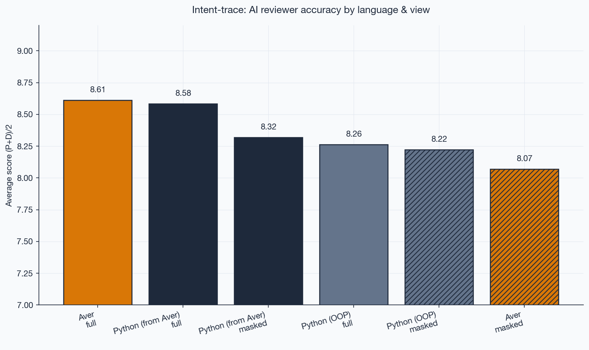

# intent-trace

**An empirical benchmark for how much author intent survives a code-change diff — measured with an LLM reviewer.**

This repo tests a claim from the [Aver language](https://averlang.dev) project: that **structurally declared intent** (signatures, description markers, decision blocks, verify blocks) makes code legible for AI review without special training on the language.

The headline finding is **parity under training asymmetry**, not victory. Aver reaches the same intent-reconstruction score as a heavily-documented Python transliteration, despite LLMs having essentially zero training exposure to Aver and trillions of tokens of Python. The ablation then isolates where that legibility actually lives.

## Method in one paragraph

For each `(program, prompt, language, view)` cell, an agent applies the change request to a baseline program, we compute the unified diff, hand it to a **reviewer LLM** (Claude Sonnet 4.6) asking it to guess the author's intent, and score the guess along two axes with a **5-model cross-vendor ensemble** (Claude Opus 4.7 + Sonnet 4.6 + Haiku 4.5 + OpenAI gpt-4o + gpt-4.1, median). Every rubric uses a **0–10 scale with descriptor anchors**. Append-only JSONL output, crash-safe, resumable.

## What we measured

### Two scoring axes per slice

- **Prompt-axis (P)** — how well the reviewer's guess matches the original change request.
- **Diff-axis (D)** — how faithfully the reviewer's guess describes what actually changed in the code.

(A third axis, *change quality*, is also computed per `(prompt, lang)` but is not the primary signal; see `src/intent_trace/judges.py`.)

### Two views per slice

- **full** — the unified diff as a PR reviewer sees it (before/after, 3 lines of context around changes).
- **masked** — same diff, but with the **prose layer stripped**: in Aver that's `intent = …`, `decision …`, `? "…"` descriptions, and `verify …` blocks; in Python that's docstrings and `#` comments. Ablation tells us what each language's prose layer actually transmits.

### Three language variants

- **aver** — the original.
- **python_from_aver** — **an intentionally non-idiomatic transliteration baseline.** It is Python syntax carrying Aver-style affordances: frozen dataclasses, pure functions, `replace()`-based updates, camelCase names, small composable helpers, and heavy docstrings lifted from Aver's `?` descriptions. Its purpose is *not* to model typical Python — it is to isolate how much review legibility comes from the carrier language versus the preserved intent structure. Treating it as "what a Python dev would write" is a misreading.
- **python_oop** — an independent OOP Python design of the same programs (classes with methods, mutation where natural, snake_case, typed exception hierarchy, **sparse** ~30–40% docstring coverage — classical idiomatic Python, the "Python a Python dev would actually write" target).

Both Python variants cover the same domains as the Aver version and their smoke tests pass independently. The three variants give a triangulation: language idiom × prose density × structural decomposition.

## Programs

| program | description | size |
|---|---|---|
| `inventory` | warehouse + SKU + reservations + reorder | ~250 lines Aver, 5 prompts |
| `workflow` | expense-report approval state machine | ~200 lines Aver, 5 prompts |
| `taskmanager` | multi-module (models / validation / projects / tasks / main) | ~400 lines Aver, 4 prompts |
| `payment_ops` | real multi-module domain: webhook normalize, cases, ledger, reconcile, views | ~1300 lines Aver, 4 prompts |

Prompts range from specific refactors ("reject negative prices") to vague directives ("make it harder to lose stock"), including one large architectural change per program.

## Results

**108 measured slices, N=18 per cell, 18 prompts across 4 programs, 5-judge cross-vendor ensemble.**

### Ranking



```
1. aver              full    avg=8.61   P=8.33  D=8.89
2. python_from_aver  full    avg=8.58   P=8.33  D=8.83    ← tie within rubric noise
3. python_from_aver  masked  avg=8.32   P=7.83  D=8.81
4. python_oop        full    avg=8.26   P=7.78  D=8.75
5. python_oop        masked  avg=8.22   P=7.72  D=8.72
6. aver              masked  avg=8.07   P=7.39  D=8.75
```

### Cross-vendor judge alignment

The ensemble spans two model families (Claude + OpenAI). Per-axis alignment:

```
Prompt-axis:  Claude-3-median = 7.96   gpt-4o = 7.53   gpt-4.1 = 7.66
Diff-axis:    Claude-3-median = 8.71   gpt-4o = 9.36   gpt-4.1 = 9.02
```

OpenAI judges are systematically *stricter* on prompt-match (-0.3 to -0.4) and *more lenient* on diff-fidelity (+0.3 to +0.6) relative to Claude median. gpt-4.1 aligns ~30% closer to Claude than gpt-4o on both axes. The biases partially cancel in the averaged ranking; the rank ordering is stable across 3-judge (Claude only) and 5-judge (cross-vendor) aggregations.

### Per-axis breakdown


### Ablation — what strip of prose reveals


```
Aver              full → masked   ΔP = -0.94   ΔD = -0.14
Python (from Aver) full → masked   ΔP = -0.50   ΔD = -0.02
Python (OOP)      full → masked   ΔP = -0.06   ΔD = -0.03
```

## Findings

Read these as statements about the specific setup described above — one reviewer family, three agent-generated baselines, 18 prompts across 4 programs — not as universal claims.

1. **Parity under training asymmetry, cross-vendor validated.** `aver/full` (8.61) and `python_from_aver/full` (8.58) are a tie within rubric noise (Δ=0.03). LLMs have near-zero training on Aver versus trillions of tokens of Python, yet a Python transliteration preserving Aver's intent structure scores at the same level. The ranking holds under both 3-judge Claude-only and 5-judge Claude+OpenAI aggregations, so the finding is not a single-family artifact.

2. **Aver concentrates intent in the prose layer, and the ablation proves it.** Strip `intent` / `decision` / `?` descriptions / `verify` blocks and Aver drops the most of any variant (-0.94 P). Aver code alone is the **weakest** of all six cells (8.07). This is not a failure of Aver — it is the experiment isolating *where* Aver's legibility actually sits.

3. **The transliteration baseline (`python_from_aver`) is the most ablation-robust** in absolute terms (8.32 masked). That's the expected behavior of a baseline designed to preserve intent structure across a language change.

4. **Idiomatic Python-OOP (sparse docstrings) is the "typical codebase" baseline.** Full and masked both ~8.2 — stable, slightly below the prose-heavy variants. No prose to lose; what you see in the code is what you get. This is what most real Python codebases look like.

5. **Ablation asymmetry reveals what each prose style actually transmits:**
   - **Aver prose** → *prompt-match precision* (P drops 0.94, D barely moves)
   - **Python-from-Aver docstrings** → *prompt-match precision too* (P drops 0.50, D stable)
   - **Python-OOP sparse docs** → *redundant ornament on code-level signal* (no measurable drop)

## Why this experiment even exists

[Aver's thesis](https://averlang.dev) is that code must be **legible to an AI reviewer** — that the artifact carries intent so a reviewer (human or AI) can reconstruct it without prior familiarity. This benchmark operationalizes that claim: we treat an LLM as the reviewer, measure how much intent it can reconstruct from each artifact style, and compare across training-exposure asymmetries.

The headline: **Aver's structural intent declarations (`intent`, `decision`, `?`, `verify`) are a functional equivalent for Python's heavy docstring tradition, from the perspective of an AI review.** Not better; equally legible. What makes this interesting is that the equivalence holds despite Aver having essentially zero training presence.

## Threats to validity

These are the reasons to treat the numbers as *indicative* rather than *conclusive*, in rough order of impact.

1. **Reviewer is still single-family (Claude Sonnet).** The **judge ensemble** is cross-vendor (3 Claude + 2 OpenAI, see above), but the reviewer LLM-B that reads the diff and produces the intent guess is still Claude Sonnet 4.6 for every slice. A fully cross-vendor benchmark would re-run with GPT / Gemini / open-weight as the reviewer. The headline thesis (Aver reaches parity with heavy-doc Python under training asymmetry) would need to be re-checked with non-Claude readers.

2. **Small domain coverage.** Four programs, 18 prompts total. Three are small/medium invented domains (inventory, workflow, taskmanager); one is a real-world multi-module domain (payment_ops, ~1300 lines). Typical enterprise codebases are 10k+ lines across dozens of modules; behavior at that scale is not tested.

3. **Agent-produced refactors, not human commits.** Both the baselines and the refactors were generated by sub-agents (Claude Code) applying the change requests. Real open-source commits from human developers would reduce construct bias, but require domain-matched Aver corpora that don't yet exist (Aver is a new language).

4. **`python_from_aver` is a transliteration baseline, not typical Python** (see above). Any reader who treats it as "what a Python dev would write" will over-read the Aver-vs-Python framing. The intended comparison is three-way (`aver` / `python_from_aver` / `python_oop`), not binary.

5. **Rubric is an LLM judging another LLM.** The 0–10 score is itself a model output, not ground truth. The score captures what a mixed Claude+OpenAI ensemble can reconstruct from a Claude Sonnet reviewer's guess; it does not capture what a human reviewer would reconstruct. We measured within-family replication (100% match with stochastic rerun, lower with paraphrased rubric) and cross-family alignment (OpenAI systematically stricter on prompt-axis, more lenient on diff-axis, but rankings stable). No human raters.

6. **`aver context` tool was tested and removed.** We initially ran an `aver_context` view (diffing compressed intent summaries) but concluded the setup was synthetic — `aver context` is a state-projection tool, not a change-representation tool, and diffing two projections doesn't match how reviewers actually use the tool. Scores collapsed in complex multi-module code for structural (not legibility) reasons. Code path dropped; historical JSONL entries from that view are not included in the headline numbers.

## Reproduce

```bash
# Install + API key
uv sync
export ANTHROPIC_API_KEY=sk-ant-...    # or use .env

# Full pipeline over all programs (reads before/ + after/<prompt>/ snapshots)
uv run --env-file .env scripts/run_all.py

# Single program
uv run --env-file .env scripts/run_all.py --programs inventory

# Resume a previous run (skips completed slices)
uv run --env-file .env scripts/run_all.py --resume results/ensemble_YYYYMMDD_HHMMSS

# Generate plots from latest JSONL
uv run python scripts/plot_results.py
```

## Layout

```
programs/<program>/
  aver/before/*.av                           # original Aver baseline
  aver/after/<prompt>/*.av                   # refactor applied by agent
  python_from_aver/before/*.py               # Aver-translated-style Python baseline
  python_from_aver/after/<prompt>/*.py
  python_oop/before/*.py                     # independent OOP Python baseline
  python_oop/after/<prompt>/*.py
prompts/<program>/*.md                       # change request per prompt

src/intent_trace/
  judges.py                                  # 3 rubrics + ensemble median
  mask.py                                    # prose-stripping for ablation

scripts/
  run_all.py                                 # pipeline entrypoint
  plot_results.py                            # chart generation

results/ensemble_<timestamp>/
  meta.json                                  # plan + model IDs
  slices.jsonl                               # one slice per line
  SUCCESS                                    # marker after clean finish
```

## Status

Dataset is complete (108 measured slices, 18 quality slices, N=18 per `(lang, view)` cell). Findings above are stable under ensemble noise (~1 point spread on prompt-axis, 0–1 on diff-axis). PRs welcome to add languages, models, or programs.

## License

MIT.
